# Содержание
0. Абстракт
1. О работе подробнее
2. Мотивация
    3. О римановой оптимизации и многообразии Штифеля
    4. О SWATS
5. Многообразие Штифеля
    6. Построение и свойства
    7. Касательно пространство
    8. Проекция
    9. Ретракции
    10. Частные случаи: ортогональная группа и гиперсфера
11. От градиентного спуска к SWATS
12. Общая идея римановой оптимизации 
13. Оптимизация на многообразии Штифеля 
14. CayleySWATS
    15. Преобразование Кэли
    16. Реализация
    17. Критерий переключения
    18. Сходимость
19. Эксперименты
    20. Ортогональное приближение
    21. Возможные модификации
22. Итоги
23. Источники
24. Приложение
___
# 0. Абстракт
# 1. О работе подробнее

Ниже представлен текст работы, проделанный автором в 2025-2026 годах в рамках ИПС LADAE, НИУ ВШЭ, под руководством Д.С.Широкова и Е.Р.Филимошиной.

В работе поставлены следующие цели:

1. Разобраться в римановой оптимизации первого порядка на примере многообразия Штифеля, понять, как она закономерно вырастает из евклидовой оптимизации первого порядка, параллельно сделав recap последней.
2. Выяснить, сохраняются ли свойства оптимизатора SWATS при прямом переносе его архитектуры на задачи с нелинейными ограничениями на примере многообразия Штифеля.
3. Формализовать изученную теорию и полученные результаты в форме блогпоста.

Вторая задача была поставлена, изучена и решена непосредственно автором; первая является обзором уже существующих результатов. Подробнее о достижениях данной работы написано в итоге. Факт выполнения четвертого пункта можно оценить непосредственно.

Сразу можно коротко ответить на вопросы второй и третьей задач: «нет, не сохраняются» и «да, работает» соответственно. Почему - будет описано в тексте работы и кратко резюмировано в итоге.

Также сразу можно ответить на вопросы второй и третьей задачи: "нет, не сохраняются" и "да, функционирует" соответственно. Почему именно так? Это будет описано в самой работе и кратко в итоге.

Наконец, несколько слов о выборе объектов исследования: оптимизатора SWATS и нелинейного пространства - многообразия Штифеля. Этот выбор прост: автор заинтересован прежде всего в сфере машинного и глубинного обучения, а оба объекта имеют в них место. Среди многочисленных альтернатив они были выбраны за субъективную «интересность», что, впрочем, крайне удобно: после первичного изучения теории и анализа объектов открывается прямой путь к исследованию их практических применений в ML и DL - эту работу автор планирует сделать в дальнейших публикациях. Подробнее о мотивации выбора - ниже.

# 2. Мотивация

## 2.1 О римановой оптимизации и многообразии Штифеля

Задачи математического программирования с ограничениями возникают часто, и не менее часто возникает желание искать их приближённое решение, что исключает методы безусловной оптимизации (градиентный спуск, метод Ньютона и др.) и точное аналитическое решение (метод множителей Лагранжа, теорема Каруша–Куна–Таккера). Ситуацию дополнительно осложняет то, что ограничения не всегда образуют простые линейные структуры.

**Проблема Прокруста.** Рассмотрим два облака точек и зададимся вопросом: существует ли такое преобразование поворота и симметрии, что облака совпадут? Если нет — насколько их можно сблизить этим действием? Формально:

$$
\begin{equation}
\min_{X \in \mathbb{R}^{n \times n}} || AX - B ||_F \quad \text{s.t.} \quad X^TX = E, \quad A,B \in \mathbb{R}^{n \times n}. \tag{1}
\end{equation}
$$

**Метод главных компонент (PCA).** Здесь ищется ортонормированный базис меньшей размерности, максимизирующий выборочную дисперсию — то есть данные «сжимаются» с минимальной потерей информации об их различимости:

$$
\begin{equation}
\max_{X \in \mathbb{R}^{n \times p}}\operatorname{tr}(X^T C X) \quad \text{s.t.} \quad X^T X = E_p, \quad C \in \mathbb{R}^{n \times n}. \tag{2}
\end{equation}
$$

**Глубинное обучение.** Ещё одна актуальная область, требующая оптимизации на многообразиях. Рассмотрим полностью линейную нейронную сеть: итоговый выход получается перемножением матриц весов, $y = W_n \cdot W_{n-1} \cdots W_1 x$. Мы хотим подобрать веса, минимизирующие функционал ошибки $Q$ на обучающей выборке. Оказывается, одно из эффективных правил обновления весов в оптимизаторе Muon [5] считается через ортогональную составляющую сингулярного разложения градиента:

$$
\begin{equation}
W_{k+1} \leftarrow W_k - \eta \cdot \gamma \cdot UV^T(\nabla_W Q), \quad \text{где } \nabla_W Q = U\Sigma V^T. \tag{3}
\end{equation}
$$

Конечно, это далеко не все задачи условной оптимизации с нелинейными ограничениями — можно также рассматривать низкоранговую аппроксимацию (LoRA) через SVD и теорему Эккарта–Янга–Минковского, обобщённую проблему Прокруста и другие схожие сюжеты.

Как видно, во всех примерах выше ключевую роль играют ограничения на ортогональность. Задачи с другими нелинейными ограничениями (например, постоянным рангом матрицы, как в LoRA) тоже важны, однако в данной работе мы сосредоточимся на римановых методах именно для ортогональных ограничений - ввиду удобства работы с такими матрицами и обоснованной их высокой применимости в современном машинном и глубинном обучении [1].
## 2.2 О SWATS

Выше было сказано об актуальности ортогональных ограничений in ML и DL. Это справедливо, но не каждая задача содержит условия на оптимизацию: часто достаточно безусловного GD и его модификаций. Многие из этих модификаций заточены под конкретную задачу и могут уступать альтернативам вне своей специализации (например, NAG делает мало итераций, но каждая вычислительно затратна; SGD - наоборот).

Такой постоянный trade-off побуждает создавать новые оптимизаторы, собирающие лучшее из уже имеющихся методов. Именно по этому пути идёт SWATS (SWitching from Adam To Sgd) [3] : он улучшает обобщающую способность алгоритма — то есть достигает меньшего значения функционала ошибки $Q$ на тестовых данных без существенных дополнительных вычислительных затрат. Идея: сначала делать быстрый адаптивный шаг Adam, а когда Adam начинает замедляться(вырождаться) (из-за накопления квадратов градиентов в знаменателе), переключаться на SGD с моментом (SGDM), инициализируя шаг через «проекцию» шагов Adam.

Поскольку идея переключения себя оправдала для безусловных оптимизаторов, закономерно возникает желание перенести её на задачи с нелинейными ограничениями - в частности, на многообразие Штифеля. Именно это будет сделано ниже.
# 3. Многообразие Штифеля

## 3.1 Построение и свойства

Формализуем упомянутую ортогональность. **Многообразием Штифеля** называется следующее множество матриц [1] :

$$
\begin{equation}
St(m,n) = { X \in \mathbb{R}^{m \times n} : X^T X = E_n }. \tag{4}
\end{equation}
$$

Его смысл: мы взяли $n$ векторов из пространства размерности $m \geq n$ и потребовали их попарной ортогональности и единичной длины (обычно по норме $||\cdot||_2$).

Можно проверить, что $St(m,n)$ — действительно многообразие: для каждой его точки существует гомеоморфизм окрестности этой точки на открытую окрестность $\mathbb{R}^{\dim St(m,n)}$ [1]. При этом:

$$
\begin{equation}
\dim St(m,n) = mn - \frac{n(n+1)}{2}. \tag{5}
\end{equation}
$$
Далее установим явные формулы для его основных характеристик, начиная с касательного пространства.

## 3.2 Касательное пространство

Мы знаем (или принимаем на веру), что для малой окрестности любой точки из $St(m,n)$ существует непрерывное отображение, задающее её локальные координаты в $\mathbb{R}^{\dim St(m,n)}$.

Теперь хотелось бы рассмотреть линейный объект - касательное пространство к многообразию - и определить его явно. Вспомним, что для гладкой функции $f : \mathbb{R}^n \ni x \mapsto y \in \mathbb{R}$ можно рассмотреть неявную функцию $F(x,y)=0$, задающую поверхность в $\mathbb{R}^{n+1}$. Касательным пространством к графику $f$ в точке $x_0$ называется:

$$
\begin{equation}
T_{x_0}\Gamma f = { v \in \mathbb{R}^{n} : DF(x_0)[v] = 0 }. \tag{6}
\end{equation}
$$

Поскольку $F(x,y) = y - f(x)$, дифференциал $DF(x_0)[v] = -\nabla f(x_0)^T v$, и условие $DF(x_0)[v]=0$ выделяет направления $v$, ортогональные градиенту $\nabla f(x_0)$, то есть касательные к графику $\Gamma f$ в точке $x_0$.

$$
\begin{equation}
\text{Рис. 1 Касательное пространство к точке сферы}
\end{equation}
$$

Этот подход естественно обобщается на матричные многообразия. Касательным пространством многообразия $\mathcal{M}$ в точке $X_0$ называется множество:

$$
\begin{equation}
T_{X_0} \mathcal{M} = {V \in \mathbb{R}^{m \times n} : DF(X_0)[V] = 0 }, \quad \text{где } F(X)=0 \text{ неявно задаёт } \mathcal{M}. \tag{7}
\end{equation}
$$

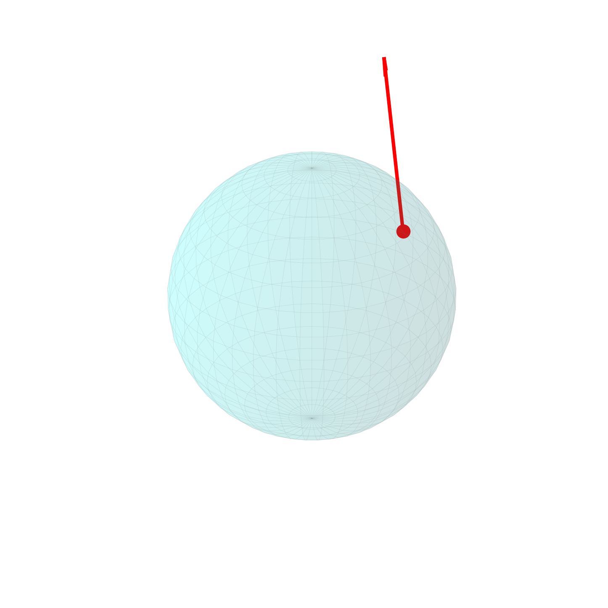

$$
\begin{equation}
\text{Рис. 2 Касательный вектор к точке сферы}
\end{equation}
$$

Применим это к $St(m,n)$. Многообразие задаётся как ${X \in \mathbb{R}^{m \times n} : X^T X = E_n}$, поэтому $F(X) = X^T X - E_n = 0$. Дифференцируем:

$$
\begin{equation}
D(X^T X - E_n)(X_0)[V] = 0
\end{equation}
$$

$$
\begin{equation}
D(X^T X)(X_0)[V] = 0
\end{equation}
$$

$$
\begin{equation}
V^T X_0 + X_0^T V = 0.
\end{equation}
$$

Таким образом:

$$
\begin{equation}
T_{X_0} St(m,n) = {V \in \mathbb{R}^{m \times n} : V^T X_0 + X_0^T V = 0}. \tag{8}
\end{equation}
$$

## 3.3 Проекция вектора на касательное пространство

Теперь мы хотим явно переводить произвольный вектор $Z \in \mathbb{R}^{m \times n}$ в $T_{X_0} St(m,n) — то есть делать проекцию.

Для проекции нужно разложить $\mathbb{R}^{m \times n}$ в прямую сумму $T_{X_0} St(m,n)$ и его ортогонального дополнения: $\mathbb{R}^{m \times n} = T_{X_0} St(m,n) \oplus T_{X_0} St(m,n)^\perp$. Тогда $Z = Z_{tan} + Z_{ort}$, и $Z_{tan} = Z - Z_{ort}$.

Найдём $T_{X_0} St(m,n)^\perp$ в явном виде. Зафиксируем (принимаем), что $\dim T_{X_0} St(m,n) = \dim St(m,n) = mn - \frac{n(n+1)}{2}$.

Рассмотрим матрицы вида $XS$ (здесь и далее $X := X_0$), где $S = \operatorname{sym}(X^T Z) = \frac{X^T Z + Z^T X}{2}$ — симметричная матрица. Утверждаем, что ${XS} \subseteq T_{X_0} St(m,n)^\perp$.

Действительно, введём стандартное скалярное произведение на матрицах: $\langle A, B \rangle = \operatorname{tr}(A^T B)$. Тогда для любого $V \in T_{X_0} St(m,n)$:

$$
\begin{equation}
\operatorname{tr}(V^T XS) = 0,
\end{equation}
$$

поскольку из условия (8) имеем $V^T X = -X^T V$, а $S^T = S$. Проверим: если $A^T = -A$ и $B^T = B$, то $\operatorname{tr}(A^T B) = \operatorname{tr}(AB)$, но $\operatorname{tr}(A^T B) = -\operatorname{tr}(AB)$, откуда $\operatorname{tr}(AB) = 0$.

Теперь о размерности. Операция $Z \mapsto \operatorname{sym}(X^T Z)$ сюръективна на $\operatorname{Sym}(n)$: любая симметричная матрица $S$ получается при $Z = XS$ (поскольку $\operatorname{sym}(X^T \cdot XS) = \operatorname{sym}(S) = S$ при $X \in St(m,n)$). При этом умножение на $X^T \in St(m,n)$ не меняет ранга. Следовательно:

$$
\begin{equation}
\dim{XS} = \dim \operatorname{Sym}(n) = \frac{n(n+1)}{2}.
\end{equation}
$$

Наконец, $\dim T_{X_0} St(m,n) + \dim{XS} = mn - \frac{n(n+1)}{2} + \frac{n(n+1)}{2} = mn = \dim \mathbb{R}^{m \times n}$, то есть $T_{X_0} St(m,n)^\perp = {XS}$, и размерностей ровно на всё пространство.

Таким образом, проекция произвольного вектора $Z$ на $T_{X_0} St(m,n)$:

$$
\begin{equation}
Z_{tan} = Z - X_0 S, \qquad S = \frac{X_0^T Z + Z^T X_0}{2}. \tag{9}
\end{equation}
$$

## 3.4 Ретракции

На данный момент мы умеем переводить произвольный вектор из $\mathbb{R}^{m \times n}$ в касательное пространство $T_{X_0} St(m,n)$. Следующий вопрос: как «лучше всего» сопоставить $Z_{tan}$ элемент из самого многообразия $St(m,n)$?

Теоретически «правильный» способ - **экспоненциальное отображение**: оно сохраняет геометрические длины и соответствует движения по геодезическим на многообразии [1]. Однако вычисление геодезических - дорогостоящая операция, а при итерационной оптимизации нам нужно лишь приближение решения, так что подобная точность чрезмерна.

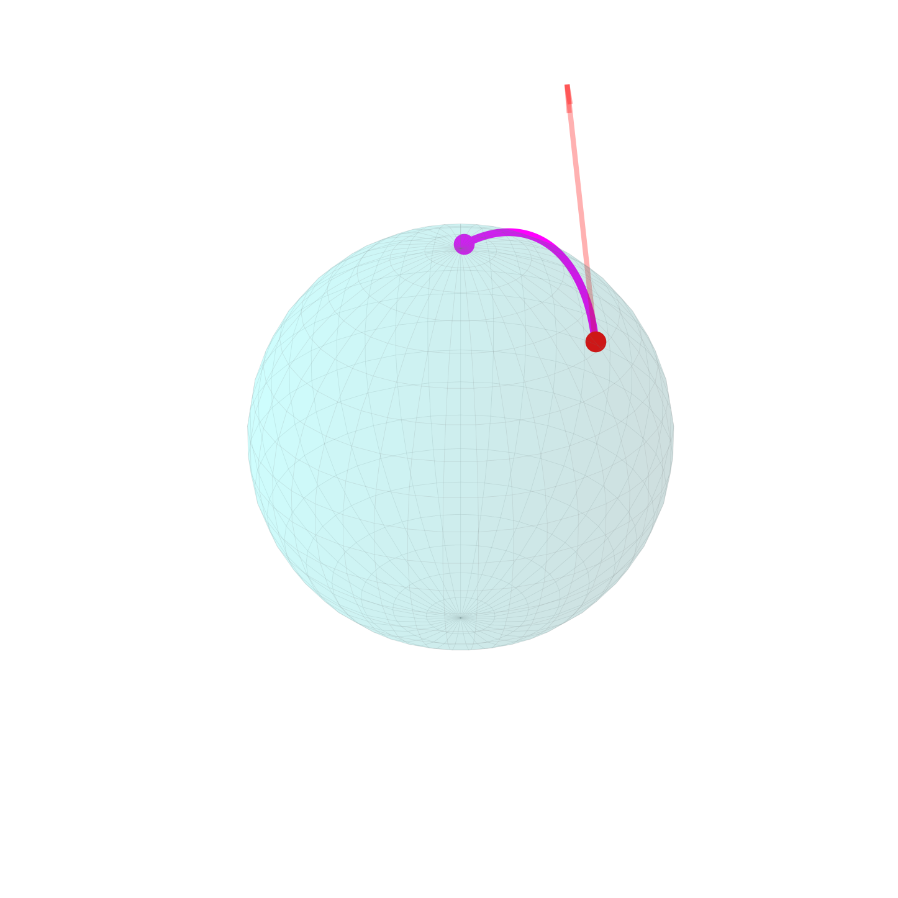

$$
\begin{equation}
\text{Рис. 3 Экспоненциальное отображение касательного вектор к точке сферы обратно на сферу}
\end{equation}
$$
Поэтому мы пользуемся **ретракцией** - более дешевым отображением $R_{X_0}: T_{X_0} St(m,n) \to St(m,n)$, которое в определённом смысле приближает экспоненциальное. Геометрически ретракция позволяет «вернуться» на многообразие из произвольной точки касательного пространства, не теряя направления движения. Рассмотрим три классических варианта для $St(m,n)$[1] :

**1. QR-ретракция.** Строится на QR-разложении: берётся ортогональный $Q$-фактор:

$$
\begin{equation}
Z_{tan} = QR \implies R_X(Z_{tan}) = \operatorname{qf}(Z_{tan}) = Q. \tag{10}
\end{equation}
$$

**2. Полярная ретракция.** Использует полярное разложение $Z_{tan} = QH$ (где $Q$ ортогональна, $H \succeq 0$):

$$
\begin{equation}
Z_{tan} = QH \implies R_X(Z_{tan}) = \operatorname{polar}(Z_{tan}) = Q. \tag{11}
\end{equation}
$$

**3. Ретракция через знак матрицы (SVD).** Вычисляется через SVD: $Z_{tan} = U\Sigma V^T$; ретракция возвращает произведение матриц сингулярных векторов, отбрасывая матрицу сингулярных чисел:

$$
\begin{equation}
Z_{tan} = U\Sigma V^T \implies R_X(Z_{tan}) = \operatorname{msign}(Z_{tan}) = UV^T. \tag{12}
\end{equation}
$$

Ни одна из этих ретракций не является экономной: наивная реализация каждой требует решения системы линейных уравнений или матричного разложения с кубической сложностью $O(n^3)$. Более дешёвая итерационная альтернатива - ретракция через открытое преобразование Кэли - будет представлена в разделе 7.

## 3.5 Частные случаи: гиперсфера и ортогональная группа

После получения явных формул для касательного пространства, проекции и ретракций рассмотрим частные случаи $St(m,n)$.

**Ортогональная группа $O(n) = St(n,n)$.** При $m = n$ всё выведенное выше (размерность, формулы касательного пространства и проекции, ретракции) справедливо для $O(n)$ без изменений. Тем не менее этот объект заслуживает отдельного внимания: многие задачи оптимизации (например, классическая проблема Прокруста, имеющая явное аналитическое решение) формулируются именно для квадратных матриц. Кроме того, $O(n)$, в отличие от $St(m,n)$ при $m > n$, образует некоммутативную группу по умножению.

**Гиперсфера $S^{m-1} = St(m,1)$.** При $n=1$ условие ортогональности вырождается в единственное требование единичной нормы, что влечет $\dim S^{m-1} = m-1$.

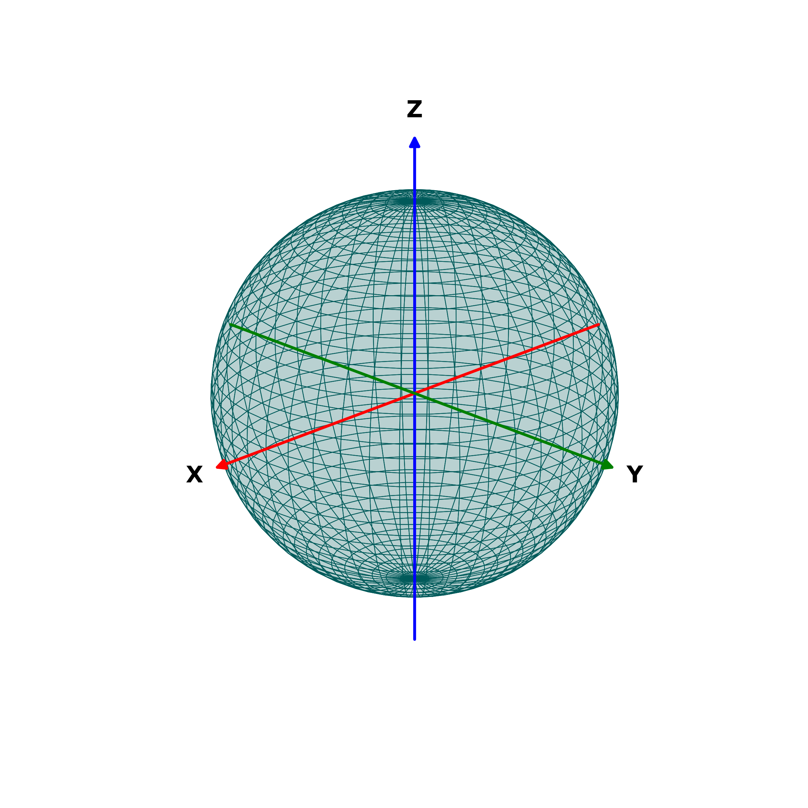

$$
\begin{equation}
\text{Рис. 4 Ортогональная группа при } n=3 \text{, то есть гиперсфера в } R^3
\end{equation}
$$

Примечательно, что $S^{m-1}$ - не только геометрически наглядный объект, но и способ построения всего многообразия Штифеля. Действительно, первый столбец $x_1$ матрицы $X \in St(m,n)$ нормирован, то есть $x_1 \in S^{m-1}$. Каждый следующий столбец $x_k$ обязан иметь единичную длину и быть ортогональным всем предыдущим $k-1$ столбцам, что геометрически понижает размерность допустимого пространства на $k-1$ единицу при взятии $k$ столбца: $x_k \in S^{m-k}$. В итоге многообразие Штифеля разлагается в последовательность вложенных сфер убывающих размерностей, и суммирование даёт формулу (5):

$$
\begin{equation}
\dim St(m,n) = \sum_{k=1}^{n} (m - k) = mn - \frac{n(n+1)}{2}. \tag{13}
\end{equation}
$$
# 4. От градиентного спуска к SWATS

На данный момент мы установили основные характеристики многообразия Штифеля: формулу проекции (9) и концепцию ретракции (10) - (12). Прежде чем переходить к римановой оптимизации на $St(m,n)$, сделаем recap евклидовой оптимизации первого порядка — это позволит последовательно подойти к оптимизатору SWATS и понять логику развития всех используемых в нём концепций.

Итак, рассмотрим задачу:

$$
\begin{equation}
Q(w) \to \min_{w \in W}, \quad Q : W \to \mathbb{R}. \tag{14}
\end{equation}
$$

Для простоты положим $W = \mathbb{R}^n$, хотя нас, конечно, интересует $W = St(m,n)$.

Аналитическое решение подобной задачи вычислительно сложно, поэтому ищем приближение итерационными методами.

### Градиентный спуск (GD)

Итерационную формулу GD можно получить, воспользовавшись свойством градиента как направления наискорейшего роста функции: чтобы убывать, нужно двигаться в направлении антиградиента $-\nabla Q$. Альтернативно: применим условия первого порядка к локальной аппроксимации $Q$ рядом Тейлора второго порядка:

$$
\begin{equation}
Q(w)=Q(w_0)+\nabla Q(w_0)(w-w_0)+\frac{1}{2}(w-w_0)^t\nabla^2Q(w_0)(w-w_0)+\overline{o}(||w-w_0||^2)
\end{equation}
$$

Отбросим пренебрежимый остаток в форме Пеано и положим $\nabla^2 Q(w_0)=E$

$$
\begin{equation}
Q(w) \approx Q(w_0)+\nabla Q(w_0)(w-w_0)+\frac{1}{2}(w-w_0)^t(w-w_0)
\end{equation}
$$

Минимизируя по $w$: $\nabla Q(w_0) + (w - w_0) = 0$, откуда $w = w_0 - \nabla Q(w_0)$.

Итерационная формула:

$$
\begin{equation}
w_k = w_{k-1} - \nabla Q(w_{k-1}). \tag{15}
\end{equation}
$$

Здесь и далее работу каждого оптимизатора будем иллюстрировать траекториями на двух классических тестовых функциях:

- **Функция Химмельблау** ($H(x, y) = (x^2 + y - 11)^2 + (x + y^2 - 7)^2$): мультимодальная функция с четырьмя одинаковыми локальными минимумами. Основная трудность - не «застрять» в пологом седле и сойтись к одному из минимумов.
- **Функция Розенброка** ($R(x, y) = (1-x)^2 + 100(y-x^2)^2$): канонический пример. Глобальный минимум находится на длинной узкой параболической «низине» в точке $(1,1)$; алгоритмам трудно ориентироваться в ней без осцилляций.

$$
\begin{equation}
\text{Рис. 5 GD на } H(x,y)\text{ и } R(x,y), \text{ 50 итераций}
\end{equation}
$$
---

**Критерий остановки.** Существует несколько стандартных условий; если не оговорено иное, используем:

$$
\begin{equation}
|w_k - w_{k-1}| < \varepsilon. \tag{16}
\end{equation}
$$

Оно легко интерпретируется и не требует вычисления значения функции в точке.

---

В своей базовой форме GD зависит от шага только через значение градиента, но не через номер итерации. Это исправляется введением параметра шага:

$$
\begin{equation}
w_k = w_{k-1} - \eta_k \nabla Q(w_{k-1}). \tag{17}
\end{equation}
$$

При выполнении условия Липшица ($|\nabla Q(x) - \nabla Q(y)| \leq L|x-y|$) естественный выбор - $\eta_k = \frac{1}{L} = \text{const}$; при дополнительной выпуклости это гарантирует сходимость.

### Momentum (GD with Momentum)

Альтернативный подход: на каждом шаге учитывать не только текущее направление, но и накопленную инерцию предыдущих шагов. Чем дальше итерация, тем меньше влияние самого первого шага:

$$
\begin{equation}
w_k = w_{k-1} - \frac{\eta_k}{1-\beta} g_k, \quad g_k = \beta g_{k-1} + (1-\beta)\nabla Q(w_{k-1}), \quad \beta \in (0,1). \tag{18}
\end{equation}
$$

После взятия «заниженного» градиента необходима bias-correction - деление на $1-\beta$: итоговый шаг $p_k = -\frac{\eta_k}{1-\beta} g_k$. Обычно $\beta = 0.9$.

$$
\begin{equation}
\text{Рис. 6 Momentum на } H(x,y)\text{ и } R(x,y), \text{ 50 итераций}
\end{equation}
$$

### NAG (Nesterov Accelerated Gradient)

Схожая идея, но вместо сглаживания шума — look-ahead: градиент вычисляется не в текущей точке, а в «предсказанной» будущей:

$$
\begin{equation}
w_k = w_{k-1} - g_k, \quad g_k = \beta g_{k-1} + \eta_k \nabla f(w_{k-1} - \beta g_{k-1}). \tag{19}
\end{equation}
$$

Это значительно увеличивает размер шага, но может давать ошибки на функциях со множеством локальных минимумов.

$$
\begin{equation}
\text{Рис. 7 NAG на } H(x,y)\text{ и } R(x,y), \text{ 50 итераций}
\end{equation}
$$
### Адаптивные методы и mini-batch

На практике вычисление полного градиента дорого, поэтому при возможности разделения минимизируемой функции на схожие составляющие часто используют его стохастическое приближение — среднее по случайной подвыборке (mini-batch $B \subset N$):

$$
\begin{equation}
\nabla Q(w) = \frac{1}{|N|} \sum_{i \in N} \nabla L_i(w), \qquad \nabla Q_B(w) = \frac{1}{|B|} \sum_{i \in B} \nabla L_i(w). \tag{20}
\end{equation}
$$

Для работы с таким «шумным» градиентом важна устойчивость - отсюда и появляются адаптивные методы.

**RMSProp** нормирует каждую компоненту градиента на корень из накопленной экспоненциально взвешенной суммы квадратов:

$$
\begin{equation}
g_{k,j} = \beta g_{k-1,j} + (1-\beta)(\nabla Q(w_{k-1}))_j^2, \qquad w_{k,j} = w_{k-1,j} - \frac{\eta_k}{\sqrt{g_{k,j}} + \varepsilon} \nabla Q(w_{k-1})_j. \tag{21}
\end{equation}
$$

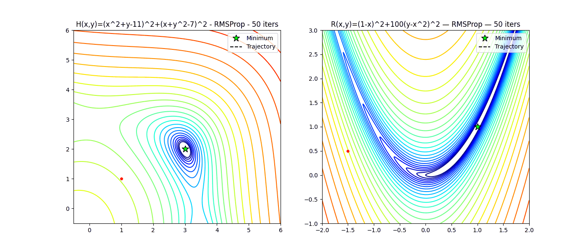

$$
\begin{equation}
\text{Рис. 7 RMSProp на } H(x,y)\text{ и } R(x,y), \text{ 50 итераций}
\end{equation}
$$

**Adam (Adaptive Momentum Estimation)** объединяет идеи Momentum и адаптивной нормировки:

$$
\begin{equation}
g_k = \nabla Q(w_{k-1}), \tag{22}
\end{equation}
$$

$$
\begin{equation}
m_k = \beta_1 m_{k-1} + (1-\beta_1) g_k, \tag{23}
\end{equation}
$$

$$
\begin{equation}
v_k = \beta_2 v_{k-1} + (1-\beta_2) g_k^2, \tag{24}
\end{equation}
$$

$$
\begin{equation}
\hat{m}_k = \frac{m_k}{1-\beta_1^k}, \qquad \hat{v}_k = \frac{v_k}{1-\beta_2^k}, \tag{25}
\end{equation}
$$

$$
\begin{equation}
w_k = w_{k-1} - \eta_k \frac{\hat{m}_k}{\sqrt{\hat{v}_k} + \varepsilon}. \tag{26}
\end{equation}
$$

$$
\begin{equation}
\text{Рис. 8 Adam на } H(x,y)\text{ и } R(x,y), \text{ 50 итераций}
\end{equation}
$$

**SGD (Stochastic Gradient Descent):**

$$
\begin{equation}
w_k = w_{k-1} - \eta_k \nabla Q_B(w_{k-1}). \tag{27}
\end{equation}
$$

Примечательно, что без убывающего $\eta_k$ SGD не сойдётся - вблизи минимума случайные mini-batch будут уводить шаг в разные стороны, порождая бесконечное блуждание.

$$
\begin{equation}
\text{Рис. 9 SGD на } H(x,y)\text{ и } R(x,y), \text{ 50 итераций}
\end{equation}
$$
Здесь для SGD и SGDM ниже стохастичность градиента проявляется в том, что случайно берется или первая, или вторая координата вектора градиента $\nabla Q = (\frac{\partial Q}{\partial x}, \frac{\partial Q}{\partial y})$
____

Резюмируя: каждый из методов преследует отдельную цель и призван лидировать в своей специализации. Поэтому часто полезен синтез методов: SGDM = SGD + Momentum, NADAM = NAG + Adam и т.д.

$$
\begin{equation}
\text{Рис. 10 SGDM на } H(x,y)\text{ и } R(x,y), \text{ 50 итераций}
\end{equation}
$$

На практике у адаптивных оптимизаторов (в частности, Adam) есть характерный недостаток: при большом числе шагов накопление квадратов градиентов в знаменателе приводит к вырождению - шаги становятся небольшими, и условие остановки выполняется **раньше**, чем при SGDM. Это означает худшее итоговое приближение к минимуму.

Именно эту проблему решает **SWATS** [3] : сначала идут итерации Adam, а после вырождения - переход на SGDM с «проекцией» параметра шага уже накопленной инерции.

### SWATS (Switching from Adam to SGD)

**Фаза 1. Adam.** Начинаем с формул (22)–(26). Раскрывая $\hat{m}_k, \hat{v}_k$:

$$
\begin{equation}
w_k = w_{k-1} - \eta_k \frac{\sqrt{1-\beta_2^k}}{1-\beta_1^k} \cdot \frac{\beta_1 m_{k-1} + (1-\beta_1)\nabla Q(w_{k-1})}{\sqrt{\beta_2 v_{k-1} + (1-\beta_2)(\nabla Q(w_{k-1}))^2} + \varepsilon}. \tag{28}
\end{equation}
$$

**Критерий. "Проекция" и переключение.** SGDM имеет вид:

$$
\begin{equation}
v_k = \beta v_{k-1} + \nabla_B Q(w_{k-1}), \qquad w_k = w_{k-1} - \gamma_{k-1} v_k. \tag{29}
\end{equation}
$$

В отличие от Momentum (18), здесь перед $\nabla_B Q$ нет множителя $(1-\beta)$ — это стандартная запись SGDM из оригинальной статьи [3]; параметр шага $\gamma_{k-1}$ уже как бы уже учитывает нормировку.

Шаг SGDM: $p^{SGDM}_k = -\gamma_{k-1} v_k$; шаг SGD: $p^{SGD}_k = -\gamma_{k-1} g_k$.

Итак, Adam вырождается, что влечет маленькие, как у SGD, стохастический градиент у которого тянется в противоположные стороны, шаги: $p^{SGD}_k \approx p^{Adam}_k$, откуда:

$$
\begin{equation}
-\gamma_{k-1} g_k \approx p^{Adam}_k \implies \gamma_{k-1} \approx -\frac{(p^{Adam}_k)^T p^{Adam}_k}{(p^{Adam}_k)^T g_k}. \tag{30}
\end{equation}
$$

**Усреднение** (экстраполяция на SGDM через скользящее среднее):

$$
\begin{equation}
\lambda_k = \beta_2 \lambda_{k-1} + (1-\beta_2) \gamma_k, \qquad \Lambda = \frac{\lambda_k}{1-\beta_2^k}. \tag{31}
\end{equation}
$$

**Критерий переключения** [3] - когда "проекция" параметра шага SGD, а значит и Adam, слабо различаются от "проекции" шага на SGDM:

$$
\begin{equation}
\left|\Lambda - \gamma_k\right| < \varepsilon. \tag{32}
\end{equation}
$$

**Фаза 2. SGDM** с построенным $\Lambda$:

$$
\begin{equation}
v_k = \beta v_{k-1} + \nabla_B Q(w_{k-1}), \qquad w_k = w_{k-1} - \Lambda v_k. \tag{33}
\end{equation}
$$

$$
\begin{equation}
\text{Рис. 11 SWATS на } H(x,y)\text{ и } R(x,y), \text{ 50 итераций}
\end{equation}
$$

Итак, SWATS сначала быстро и адаптивно продвигается к минимуму за счет Adam, затем, когда Adam вырождается, согласно критерию, переключается на SGDM, инициализированный "проекцией" параметра шага Adam и действующий из уже приближенной к минимуму точки, в чем и заключается концепция warm-up, через улучшенные по отношению к SGD и, а значит и к выродившемуся ADAM, итерации. Это даёт лучшую обобщающую способность, чем чистый Adam.
## 5. Общая схема римановой оптимизации

На данный момент мы знаем, что у многообразий можно задавать касательные пространства в точке, находить проекцию произвольных векторов на эти самые пространства, а также после переводить касательные векторы в сами многообразия с помощью ретракций. 
Также нам известно, что градиентный спуск и его модификации позволяют итерационно находить минимум функций типа $Q:\mathbb{R}^{m\times n}\rightarrow\mathbb{R}$.
Попытаемся объединить эти идеи воедино с целью реализовать итерационную процедуру поиска минимума(точнее - близкой к нему точки) функции $Q$ на многообразии $\mathcal{M}$:
1. Инициализируем $X_0 \in \mathcal{M}$ 
2. Вычисляем $\nabla Q(X_k)$
3. Вычисляем 

$$
\begin{equation}
{\nabla Q(X_k)}_{tan} \leftarrow \nabla Q(X_k)-\nabla Q(X_k)_{ort} \tag{34} 
\end{equation}
$$

и определяем риманов градиент как  

$$
\begin{equation}
riGrad \space Q(X_k):={\nabla Q(X_k)}_{tan} \tag{35} 
\end{equation}
$$

4. Производим шаг выбранным оптимизатором через применение функции $p_k$ на итерации $k$ к риманову градиенту вместо обычного 

$$
\begin{equation}
\overline{X_{k+1}}\leftarrow X_k-p_k(riGradQ(X_k)) \tag{36} 
\end{equation}
$$

После этого шага нам рано заканчивать итерацию и переходить к следующей: $\mathcal{M}$ как правило нелинейно, точка $\overline{X_{k+1}}$ может не принадлежать $\mathcal{M}$. Поэтому нам и необходимо сделать ретракцию.
5. 

$$
\begin{equation}
X_{k+1} \leftarrow R_{X_k}(\overline{X_{k+1}}) \tag{37} 
\end{equation}
$$

6. Повторяем итерации до того момента, пока не сработает критерий остановки, например,  

$$
\begin{equation}
\text{DO }2-5 \text{ WHILE } ||X_{k+1}-X_k||_F\geq\varepsilon.\tag{38} 
\end{equation}
$$

Формально общая схема римановой оптимизации имеет вид:
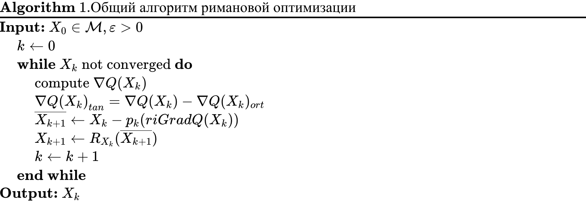
## 6. Оптимизация на многообразии Штифеля

Теперь хотелось бы сделать следующее: реализовать общий алгоритм на примере конкретного оптимизатора и ретракции для $St(m,n)$, выявить некоторые имеющиеся проблемы и идентифицировать компоненты, вычисления для которых можно выполнять эффективнее. Итак, реализация RiADAM на $St(m,n)$:
1. 

$$
\begin{equation}
X_0 \in St(m,n) \tag{39} 
\end{equation}
$$
2. 

$$
\begin{equation}
\nabla Q(X_k).\tag{40} 
\end{equation}
$$
3. 

$$
\begin{equation}
riGrad \space Q(X_k):=\nabla Q(X_k)-X_k\frac{{X_k}^t\nabla Q(X_k)+{\nabla Q(X_k)}^tX_k}{2}.\tag{41} 
\end{equation}
$$

    4. Перед реализацией шага RiADAM необходимо обговорить первую трудность: адаптивные оптимизаторы, к которым относится ADAM, делают шаги на основе накопленных инерций, однако здесь инерция на шаге $k$ находится на касательном пространстве к точке $k.$ Как перенести инерцию на $k+1$ касательное пространство? Существуют различные способы, один из них - параллельный перенос, то есть каждый раз делать проекцию инерции предыдущего шага на новое касательное пространство. Будем поступать именно так, причем как для инерции, так и для итогового шага $\eta_k$. Как мы увидим позже, на произвольном многообразии адаптивность ADAM нарушается из-за постоянного проектирования и применения ретракций, ввиду этого для $v_k$ может рассматриваться не матрица, полученная применением произведения Адамара(поэлементного произведения), а скаляр - $||\cdot ||_F^2$, например. Пока остановимся на первом подходе, так как он является каноническим в SWATS: 

$$
\begin{equation}
m_k = \beta_1 \tilde{m}_{k-1} + (1 - \beta_1) \operatorname{riGrad} Q(X_k) \tag{42} 
\end{equation}
$$

$$
\begin{equation}
\tilde{m}_{k-1}={m}_{k-1}-X_k\frac{{X_k}^t{m}_{k-1}+{m^t_{k-1}}X_k}{2}.\tag{43} 
\end{equation}
$$

$$
\begin{equation}
v_k = \beta_2 \tilde{v}_{k-1} + (1 - \beta_2) (\operatorname{riGrad} Q(X_k) \odot \operatorname{riGrad} Q(X_k)) \tag{44} 
\end{equation}
$$

$$
\begin{equation}
\tilde{v}_{k-1}={v}_{v-1}-X_k\frac{{X_k}^t{v}_{k-1}+{v^t_{k-1}}X_k}{2}.\tag{45} 
\end{equation}
$$

$$
\begin{equation}
{\eta}_k = \left( \frac{\frac{m_k}{1 - \beta_1^k}}{\sqrt{\frac{v_k}{1 - \beta_2^k}} + \varepsilon} \right). \tag{46} 
\end{equation}
$$

$$
\begin{equation}
\tilde{\eta}_{k}={\eta}_{k}-X_k\frac{{X_k}^t{\eta}_{k-1}+{{\eta}^t_{k-1}}X_k}{2} \tag{47} 
\end{equation}
$$

$$
\begin{equation}
\overline{X_{k+1}}\leftarrow X_k-\alpha\bar\eta_k \tag{48} 
\end{equation}
$$

    5.  

$$
\begin{equation}
\overline{X_{k+1}}=QR \tag{49} 
\end{equation}
$$

$$
\begin{equation}
X_{k+1} = \operatorname{qf}(\overline{X_{k+1}})=Q \tag{50} 
\end{equation}
$$

    6.  

$$
\begin{equation}
\text{DO }2-5 \text{ WHILE } ||X_{k+1}-X_k||_F\geq\varepsilon \tag{51} 
\end{equation}
$$

Таким образом:
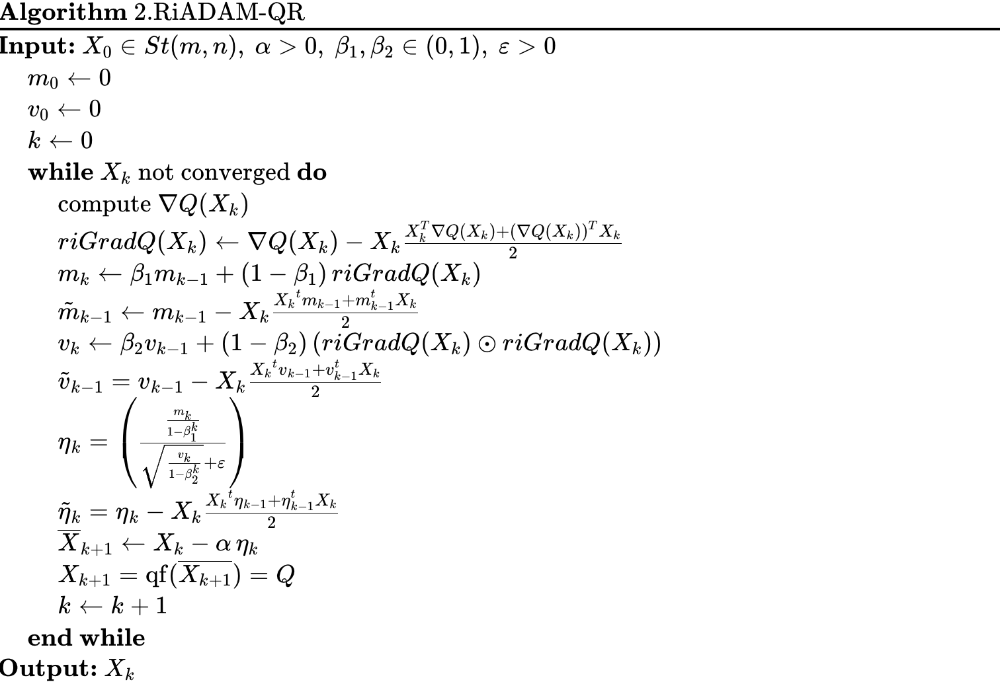
Итак, как было отмечено, реализация адаптивного алгоритма RiADAM на многообразии Штифеля сталкивается с серьезными противоречиями. 

Первая проблема заключается в разрушении концепции ADAM: постоянный перенос инерций ($m_k$, $v_k$) и шага ($\eta_k$) на новые касательные пространства нивелирует геометрию накопленных моментов, а поэлементное произведение теряет свой координатный смысл, из-за чего алгоритм утрачивает способность адаптивно настраивать шаг и превращается в зашумленный SGD.

Во-вторых, с вычислительной точки зрения слабым местом являются представленные на данный момент ретракции, требующие «тяжелого» QR, QH или SVD разложения с кубической сложностью на каждой итерации. 

В-третьих, возникает иррациональность в использовании ресурсов, поскольку существенные затраты на подсчет полного евклидова градиента фактически пренебрегаются последующим проецированием его на касательное пространство, в процессе которого часть информации теряется.

# 7. CayleySWATS

Поскольку ADAM является непосредственной частью самой концепции SWATS, перед построением данного оптимизатора на $St(m,n)$ без радикальной смены идеи возможно решить лишь последнюю, третью, проблему из возникших выше трех, а уже после рассмотреть возможные решения всех проблем. Итак, об эффективной ретракции.

Как было упомянуто несколько выше, экономной альтернативой представленным ретракциям выступает открытое преобразование Кэли. В явной закрытой форме (ClosedCayley) ретракция задается

$$
\begin{equation}
R_{X_0}(\alpha, Z_{tan})=\left(E - \frac{\alpha}{2} Z_{tan}\right)^{-1}\left(E + \frac{\alpha}{2} Z_{tan}\right)X_0, \tag{52}
\end{equation}
$$

$$
\begin{equation}
\text{причем } E-\alpha Z_{tan} \text{ всегда обратима по построению}.
\end{equation}
$$

Действительно, отображение сохраняет структуру $St(m,n)$:

$$
\begin{equation}
R_{X_0}(\alpha, Z_{tan})^tR_{X_0}(\alpha, Z_{tan}) = E \tag{53}
\end{equation}
$$

$$
\begin{equation}
\text{при любом шаге } \alpha \ge 0.
\end{equation}
$$

Однако операция обращения матрицы имеет неприемлемую кубическую сложность.
Для ликвидации этой проблемы применяется открытая форма Кэли(OpenCayley), переводящая исходное выражение в неявное уравнение 

$$
\begin{equation}
R_{X_0}(\alpha, Z_{tan}) = X_0 + \frac{\alpha}{2}Z_{tan}\big(X_0 + R_{X_0}(\alpha, Z_{tan})\big) \tag{54}
\end{equation}
$$

Приближенное решение этой системы находится итерационно:

$$
\begin{equation}
Y^{i+1} = X + \frac{\alpha}{2}W\big(X + Y^{i}\big)\Big|_{Y=R_{X_0}(\alpha, Z_{tan})} \tag{55}
\end{equation}
$$

$$
\begin{equation}
Y^0 = X + \alpha V \tag{56}
\end{equation}
$$

На практике оказывается достаточным взятие всего лишь 2 итераций.
Таким образом, итерационный алгоритм ретракции $OpenCayley$ формально имеет вид:
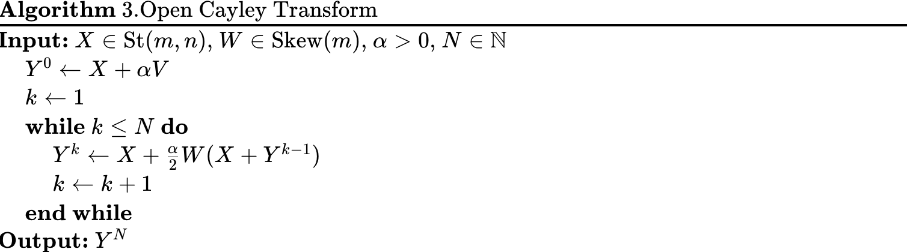
На основе этой ретракции можно построить соответственно RiSGDM и RiADAM на $St(m,n)$, получая следующие алгоритмы:
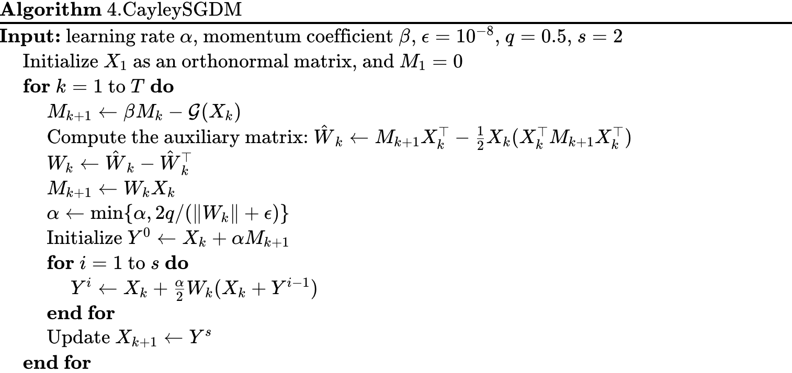
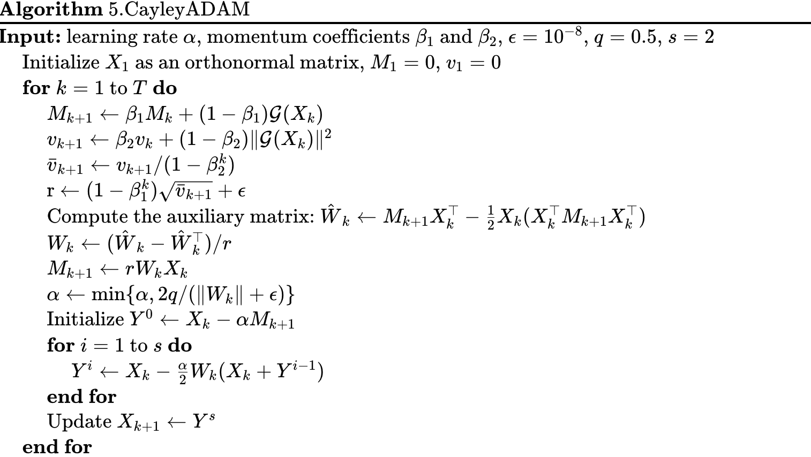
Как можно заметить, in алгоритмах выше проекция на касательное пространство считается иначе, чем выводилось выше. Данная запись является лишь альтернавивой $Z-Z_{ort},$ ее можно получить через пересбор множителей, что делает ее полностью эквивалентной представленной выше формуле.
Еще одно отличие заключается в том, что здесь вместо поэлементного произведения берется скаляр - норма. В реализации CayleySWATS ниже данный подход будет опущен ввиду его несоответствию первичному SWATS.
## 7.2. Реализация
Сейчас мы смогли решить единственную решаемую при неизменном переносе архитектуры проблему, что дало нам экономные CayleySGDM и CayleyADAM.
Поскольку первично SWATS содержал в себе именно эти оптимизаторы, мы можем построить общую схему CayleySWATS, взяв за основу фаз CayleySGDM и CayleyADAM с точностью до счета проекций на касательные пространства и вычисления $v$:
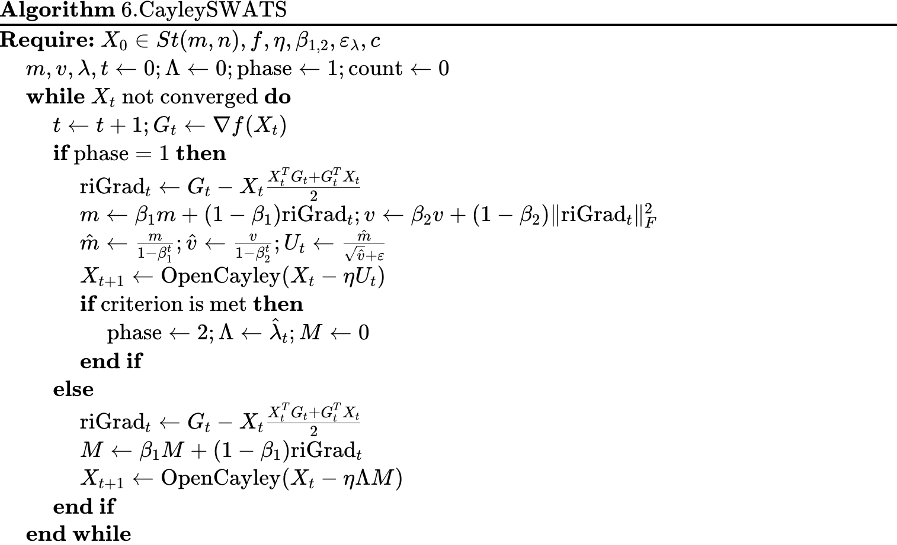
Все что осталось - смоделировать эффективный критерий перелючения с CayleySGDM на CayleyADAM.
## 7.3. Критерий переключения
Для начала вспомним логику построения критерия для евклидового случая, оригинального SWATS:

$$
\begin{equation}
\text{ADAM выродился }\implies p^{SGD}_k \approx p^{ADAM}_k
\end{equation}
$$

$$
\begin{equation}
p^{SGD}_k=-\gamma_{k-1}\,g_k\approx p^{ADAM}_k \tag{30}
\end{equation}
$$

$$
\begin{equation}
-\gamma_{k-1}\,(p^{ADAM}_k)^tg_k\approx (p^{ADAM}_k)^tp^{ADAM}_k \tag{30}
\end{equation}
$$

$$
\begin{equation}
\gamma_{k-1}\,\approx -\frac{(p^{ADAM}_k)^tp^{ADAM}_k}{(p^{ADAM}_k)^tg_k} \tag{30}
\end{equation}
$$

$$
\begin{equation}
\lambda_k=\beta_2\,\lambda_{k-1}+(1-\beta_2)\,\gamma_k. \tag{31}
\end{equation}
$$

$$
\begin{equation}
\Lambda=\frac{\lambda_k}{1-\beta_2^k}.\tag{31}
\end{equation}
$$

$$
\begin{equation}
\text{переключение при} \left|\Lambda -\gamma_k\right|<\varepsilon \tag{32}
\end{equation}
$$

$$
\begin{equation}
\text{причем } p^{SGDM}_k=\eta \Lambda g_k. \tag{33}
\end{equation}
$$

Построим первый наивный критерий: введем скалярное произведение на матрицах как $<A,B>_E=tr(A^tEB)=tr(A^tB)$, а далее положим $\gamma_{k-1}\,\approx -\frac{<p^{ADAM}_k, p^{ADAM}_k>_E}{<p^{ADAM}_k, g_k>_E}$. Причем здесь, в отличие от оригинального SWATS, будем переключаться лишь при последовательном выполнении критерия переключения: постоянные ретракции добавляют шум, который может случайно разово направить шаг в направлении момента, что вызовет несодержательное и преждевременное выполнение критерия. Данная особенность переключения позволяет бороться с относительной зашумленностью риманова градиента, поэтому будет присутствовать во всех критериях.
Построение же $\Lambda$ для всех четырех критериев, включая этот, также оставим неизменным, как и отсутствии начальной инерции при переходе на $SGDM: M \leftarrow 0$.
Так, получается оптимизатор CayleySWATS-Naive:
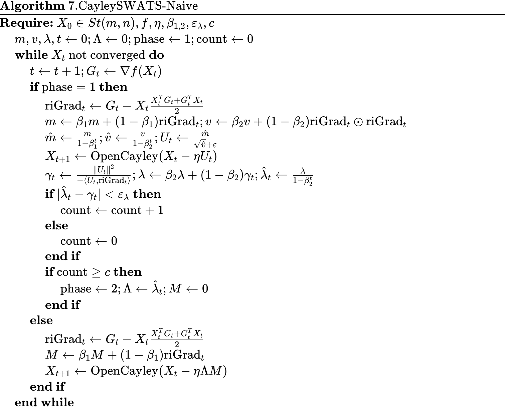
Для построения второго критерия попытаемся применить геометрический смысл вырождения ADAM в евклидовом случае и далее сделать его экстраполяцию на нелинейные структуры: поскольку вырождение ADAM влечет небольшие, как у $SGDM$, шаги, поэтому итерации после вырождения не сильно влияют на общую накопленную инерцию, отсюда можно переключаться при небольшом отличии текущего направления от накопленного, причем благодаря скалярному произведению данное отличие можно измерять углом косисуна между текущим шагом и накопленным направлением, что, согласно идее, дает оптимизатор CayleySWATS-Angle:
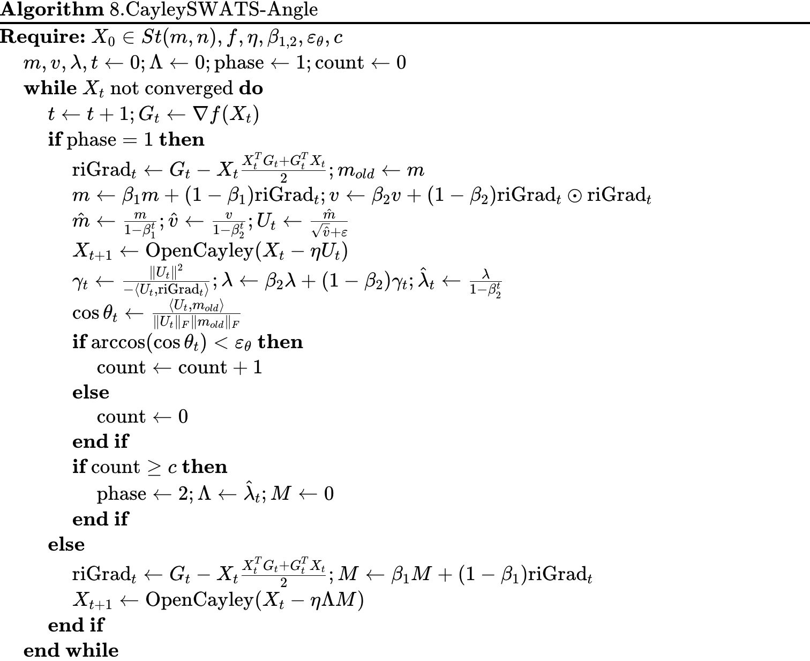
Альтернативно можно посмотреть на геометрию длин: при вырождении евклидовый ADAM накопил достаточную инерцию, а шаги поэтому стали небольшими, чтобы учесть данную ситуацию, которая становится постоянной после момента вырождения, можно рассматривать отношение норм шага, содержащего инерцию, и текущего риманова градиента. Безусловно, отношение может стабилизироваться несколько шагов подряд и в начале итерирования, однако данная случайность компенсиется необходимостью счетчика выполнения критерия перейти определенный порог, являющийся гиперпараметром. Поскольку в данной постановке мы рассматриваем отношение двух величин, данный критерий можно считать в определенном смысле связанным с проекций, хотя он, конечно, не содержит в себе формального проектирования, как и критерий оригинального SWATS, тем не менее использующий самую идею проекции. Так, имеем $CayleySWATS-Prokection$:
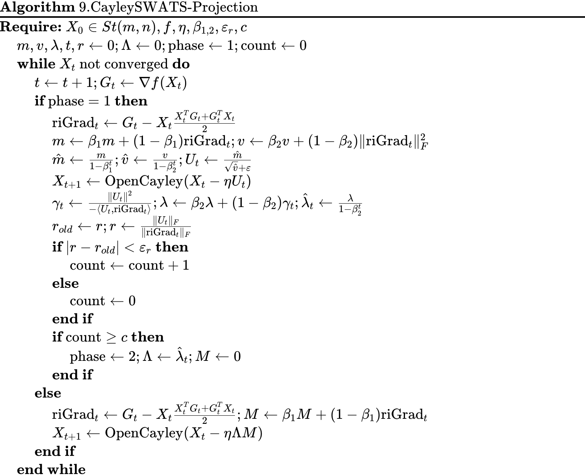
Все три представленные критерия оперировали лишь одним условием. Может иметь смысл для более позднего переключения включить несколько условий, которые должны будут выполняться несколько шагов для переключения. Так, сейчас $\lambda$ содержит в себе информацию, которая будет использована после переключения, а риманов градиент - текущую, поскольку проекция строится именно на касательных пространствах к точкам, уже вычисленным CayleyADAM. Поскольку функции могут принимать большие значения, для удобства оценки изменения риманова градиента можно брать его относительное, а не абсолютное, изменение. Так, мы получаем два условия, которые должны выполняться одновременно и несколько итераций подряд для переключения, что дает CayleySWATS-Hybrid:
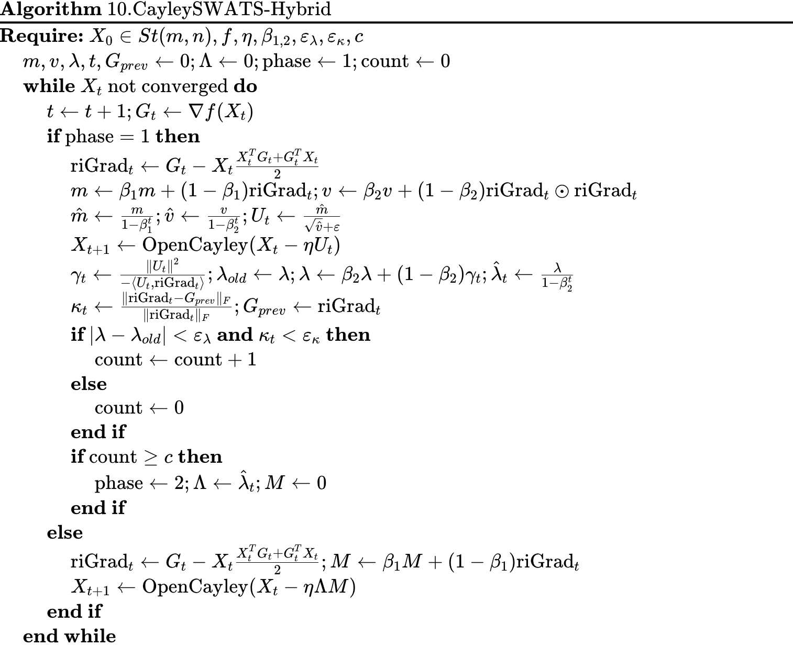
Представленные выше критерии не содержат в себе гарантированной математической идеи, хотя строго формализованы: все они строятся или эмпирически из соображений опыта, логики и экспериментов или напрямую из геометрии, причем евклидовой. В этом нет проблемы, поскольку здесь все критерии служат иллюстрациями определенных разумных идей, которые могут как сработать на определенных задачах, так и быть неверными по построению. 
Однако куда более глубокой проблемой является сам факт адаптивности первой стадии итераций CayleySWATS - на произвольном многообразии проекции и ретракции применяются ко всей матрице, что добавляет колоссальное количество шума, лишь усиливающегося теряющими смысл преобразованиями самого оптимизатора. Так, несмотря на простоту и применимость используемой SWATS и CayleySWATS концепции warm-up(итерации конечного оптимизатора начинаются с уже достигнутой непроизвольной точки), как будет видно, данная концепция, как и другие идеи(критерии, эффективная ретракция) является неэффективной ввиду нерабочей первой стадии, непреклонно пытающейся применить адаптивность в условиях повышенного шума.
## 7.4 Сходимость

Поскольку на второй фазе алгоритм CayleySWATS с точностью до вычисления эквивалентных проекций совпадает с CayleySGDM, анализ его сходимости напрямую опирается на теоретические результаты работы [2]. 

При этом число итераций первой стадии $k$ в такой схеме можно рассматривать как настраиваемый гиперпараметр алгоритма. Начиная с полученной точки, траектория оптимизации строго следует методу CayleySGDM, полностью наследуя все его гарантии сходимости к стационарной точке на многообразии Штифеля.

Тем не менее, практическая применимость допущения о конечности $k$ полностью подтверждается экспериментально. В проведенных численных симуляциях переключение с адаптивного режима на режим с импульсом происходило за конечное и вполне обозримое число шагов.

Строгое теоретическое доказательство того, что критерий переключения гарантированно выполнится за конечное число шагов, существенно зависит от конкретной формулировки триггера и в общей постановке остаётся открытым вопросом. 

Теорема (сходимость CayleySWATS).

Пусть

1. На фазе CayleyADAM за начальные k итераций достигается точка $X_k$.
2. Начиная с шага m = k+1, алгоритм итерируется как CayleySGDM в течение $T$ шагов.
3. Выполнено условие гладкости целевой функции: евклидов градиент $\nabla Q$ является Липшицевым с константой $L > 0$:

$$
\begin{equation}
\|\nabla Q(X) - \nabla Q(Y)\| \le Q\|X - Y\|, \quad \forall X, Y \tag{57}
\end{equation}
$$

* Размер шага $\alpha$ для фазы CayleySGDM задан в соответствии с:

$$
\begin{equation}
 \alpha = \min\left\{\frac{1-\beta}{L}, \frac{A}{\sqrt{T+1}}\right\},  \text{где } A > 0, \beta \in [0, 1). \tag{57}
\end{equation}
$$

Тогда имеет место

$$
\begin{equation}
\min_{m=k,\dots,k+T-1} \mathbb{E}[||\nabla_{\mathcal{M}} f(X_m)||^2] = \underline{O}\left(\frac{1}{\sqrt{T+1}}\right) \tag{58}
\end{equation}
$$

То есть минимальное математическое ожидание квадрата нормы риманова градиента на $St(m,n)$ за $T$ итераций убывает линейно с ростом $T$.

$$
\begin{equation}
\text{Соответственно} \lim_{T \to \infty} \min_{m=k,\dots,k+T-1} \mathbb{E}[||\nabla_{\mathcal{M}} f(X_m)||^2] = 0 \tag{59}
\end{equation}
$$

# 8. Эксперименты

## 8.1. Ортогональное приближение

Задача ортогонального приближения (orthogonal Procrustes) заключается в том, чтобы найти матрицу $\Omega \in O(n))$, минимизирующую фробениусову нормы до заданной матрицы $Ф$:

$$
\min_{\Omega \in O(n)} ||A - \Omega||_F^2. \tag{60}
$$

Данная задача крайне удобна для проведения серий тестов, поскольку является квадратичной, имеет сравнительно небольшой по вычислениям евклидов градиент, а также явное аналитическое решение: $X^* = UV^T$ через SVD ($A = U\Sigma V^T$), что позволяет точно оценить качество каждого оптимизатора.

Далее для матриц размера $n = 256$ проведем форсированно 600 итераций оптимизаторов, усредняя по 100 независимым запускам с  $fine-tuned$ гиперпараметрами.

Cравниваются следующие оптимизаторы: 
1. Newton-Shulz с коэффициентами Muon
2. RGD-QR
3. CayleySGDM
4. CayleySWATS-Naive
5. CayleySWATS-Angle
6. CayleySWATS-Projection
7. CayleySWATS-Hybrid

Будут рассматривать 3 метрики:
1. Число итераций, необходимое для достижения относительно, сравнивая с оптимальным значением, ошибки менее $0.1$
2. Суммарное число матричных умножений за 600 итераций
3. Итоговая субоптимальность

Вообще говоря данный тест будет не очень честным, так как для SGD будет браться не стохастический а обычный градиент, что делает SGDM просто моментумом, но это уменьшает шум и позволяет оценить все оптимизаторы в более честных услойи, независимо от качества построения стохастической оценки градиента например как нормы произвольного столбца раз у нас норма фробениуса

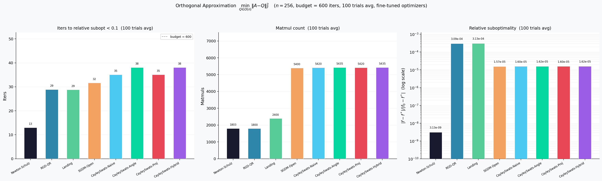

**Результаты.** На графике видна следующая картина:
1. Ожидаемо Newton-Shulz лучше всего как директ солвер, но он не дошел до оптимального значения так как коэффициенты Muon уменьшают сингулярные числа, а не делают матрицу единичной

- **CayleySGDM** уверенно лидирует по всем трём метрикам: достигает порога субоптимальности за наименьшее число итераций (~13), при меньшем числе matmul, и оставляет минимальную итоговую ошибку (~$2\times10^{-9}$). Это подтверждает теоретические гарантии сходимости алгоритма [3].
    
- **Все варианты CayleySWATS** уступают CayleySGDM по всем метрикам: итоговая субоптимальность на 2–4 порядка выше, число итераций до порога — примерно в 2–3 раза больше (30–36), а matmul count — ощутимо выше из-за дополнительных операций первой фазы.
    
- **Различия между критериями** переключения (Naive, Angle, Projection, Hybrid) незначительны: ни один из них не обеспечивает заметного преимущества перед другим, что свидетельствует о том, что проблема лежит не в выборе момента переключения, а в самой первой фазе — CayleyADAM.
    
- **RiADAM (наивный)** и **RiSGD** справляются хуже всех по скорости и точности, как и ожидается: первый страдает от разрушения адаптивности при проектировании, второй — от отсутствия инерции.
    

**Вывод.** Концепция warm-up (запуск из уже достигнутой точки) не компенсирует потерь, вносимых первой фазой: зашумлённые итерации CayleyADAM приводят к точке, из которой CayleySGDM приходится затем «выбираться», а не стартовать в выгодной близости к минимуму. Таким образом, прямой перенос архитектуры SWATS на многообразие Штифеля не сохраняет преимуществ оригинального оптимизатора.

## 8.2. Возможные модификации

Из проведённого анализа и экспериментов вытекает несколько направлений возможных модификаций CayleySWATS, которые могут частично устранить выявленные проблемы.

**1. Скалярный второй момент.** Вместо матрицы $v_k$, получаемой поэлементным произведением риманова градиента и теряющей смысл после проекций, можно использовать скалярную оценку $v_k = |\text{riGrad}_t|_F^2$ — как это делается в CayleyADAM из [3]. Это устраняет координатную бессмыслицу адаптивности, хотя и ценой потери покоординатной настройки шага: адаптивность становится изотропной, но по крайней мере не добавляет шума.

**2. Ранний запуск CayleySGDM.** Поскольку первая фаза (CayleyADAM) добавляет шум, имеет смысл делать её как можно короче: устанавливать агрессивный порог критерия переключения или фиксировать максимальное число итераций фазы 1. В пределе — запускать сразу CayleySGDM, что, как показывают эксперименты, является наилучшей стратегией для задачи ортогонального приближения.

**3. Геодезические шаги.** Замена ретракции OpenCayley на точное экспоненциальное отображение могла бы повысить качество шагов. Однако, как отмечалось, вычислительная стоимость геодезических на $St(m,n)$ кубична, и на практике это нецелесообразно; исключение составляет гиперсфера $S^{m-1}$, где экспоненциальное отображение вычисляется дёшево.

**4. Риманов NADAM.** Аналогично евклидовому NADAM = NAG + Adam, перенос идеи look-ahead на касательное пространство (Riemannian NAG) с последующим переключением на CayleySGDM может дать лучшую инициализацию для второй фазы, поскольку NAG делает более аккуратные шаги, чем Adam, вблизи минимума.

**5. Адаптивный выбор $\Lambda$.** В текущей реализации $\Lambda$ вычисляется по скользящему среднему шагов первой фазы (формула (31)). Альтернативно можно выбирать $\Lambda$ как медиану или оценку через линейный поиск Армихо уже на первой итерации CayleySGDM, что снизит зависимость от зашумлённых итераций первой фазы.

Все перечисленные модификации являются предметом дальнейших исследований; их полноценная экспериментальная оценка выходит за рамки данной работы.

# 9. Итоги

В данной работе были достигнуты следующие результаты.

**По первой задаче** (обзор римановой оптимизации первого порядка на многообразии Штифеля): изложена конструкция $St(m,n)$ как матричного многообразия [1], выведены явные формулы касательного пространства (8), проекции (9), трёх классических ретракций (10)–(12) и их частных случаев — ортогональной группы $O(n)$ и гиперсферы $S^{m-1}$. Параллельно выполнен recap евклидовой оптимизации первого порядка: GD, Momentum, NAG, RMSProp, Adam, SGD, SGDM, SWATS (формулы (15)–(33)). Показано, как каждый из евклидовых шагов естественно переносится на многообразие через проекцию риманова градиента и ретракцию (Алгоритм 1).

**По второй задаче** (перенос SWATS на $St(m,n)$): выяснено, что прямой перенос архитектуры SWATS на многообразие Штифеля **не сохраняет** его ключевых свойств. Выявлены три принципиальных противоречия: разрушение адаптивности Adam при параллельном переносе моментов, кубическая сложность классических ретракций и иррациональность полного евклидова градиента при его последующем проецировании. Третья проблема решена заменой ретракции на экономное открытое преобразование Кэли [3,4] (Алгоритм 3), что дало алгоритмы CayleySGDM и CayleyADAM. На их основе построены четыре варианта CayleySWATS с различными критериями переключения: Naive, Angle, Projection, Hybrid. Для второй фазы (CayleySGDM) доказана сходимость со скоростью $O(1/\sqrt{T})$ (теорема из раздела 7.4), унаследованная от результатов [3].

Экспериментальная проверка на задаче ортогонального приближения ($n=256$, 600 итераций, 100 запусков) показала, что **CayleySGDM превосходит все варианты CayleySWATS** по числу итераций до сходимости, числу матричных умножений и итоговой субоптимальности. Это эмпирически подтверждает вывод: warm-up через зашумлённую первую фазу не приносит пользы — первые итерации CayleyADAM скорее мешают, чем помогают. Все четыре критерия переключения ведут себя схоже, что указывает на то, что корень проблемы — в первой фазе, а не в выборе момента переключения.

**По третьей задаче** (формализация в виде блогпоста): она выполнена непосредственно в виде настоящего текста.

**Открытые вопросы** для дальнейшей работы: строгое доказательство конечности числа итераций до переключения; разработка риманового аналога SWATS с нерушащимся адаптивным первым шагом (например, через геодезический поиск или риманов NADAM); применение предложенных алгоритмов к реальным задачам ML/DL с ортогональными ограничениями (Muon [5], LoRA, обобщённая задача Прокруста).

# 10. Источники

1. Absil, P.-A., Mahony, R., & Sepulchre, R. (2008). _Optimization Algorithms on Matrix Manifolds_. Princeton University Press.
2. Nitish Shirish Keskar, Richard Socher. [Improving Generalization Performance by Switching from Adam to SGD](https://arxiv.org/pdf/1712.07628). Preprint, 2017.
3. Jun Li, Li Fuxin, Sinisa Todorovic. [Efficient Riemannian Optimization On The Stiefel Manifold Via The Cayley Transform](https://arxiv.org/pdf/2002.01113). ICLR 2020.
4. Pierre Ablin, Gabriel Peyré. [Fast and accurate optimization on the orthogonal manifold without retraction](https://arxiv.org/pdf/2102.07432). AISTATS 2022.
5. Jeremy Bernstein. [Modular Manifold](https://thinkingmachines.ai/blog/modular-manifolds/#manifold-muon). Thinking Machines Blog, 2025; [Orthogonal Manifold](https://docs.modula.systems/algorithms/manifold/orthogonal/). Modula Docs, 2025.
6. Gary Becigneul, Octavian-Eugen Ganea. [Riemannian Adaptive Optimization Methods](https://arxiv.org/pdf/1810.00760). ICLR 2019.
7. Polyak, B. T. (1964). Some methods of speeding up the convergence of iteration methods. _USSR Computational Mathematics and Mathematical Physics_, 4(5), 1–17.
8. Nesterov, Y. (1983). A method for solving a convex programming problem with convergence rate $O(1/k^2)$. _Soviet Mathematics Doklady_, 27(2), 372–376.
9. Hinton, G., Srivastava, N., & Swersky, K. (2012). Neural networks for machine learning — Lecture 6e: rmsprop. Unpublished lecture slides, University of Toronto. [http://www.cs.toronto.edu/~tijmen/csc321/slides/lecture_slides_lec6.pdf](http://www.cs.toronto.edu/~tijmen/csc321/slides/lecture_slides_lec6.pdf)
10. Kingma, D. P., & Ba, J. (2015). [Adam: A Method for Stochastic Optimization](https://arxiv.org/pdf/1412.6980). ICLR 2015.
11. Robbins, H., & Monro, S. (1951). A stochastic approximation method. _The Annals of Mathematical Statistics_, 22(3), 400–407.

# 11. Приложение
