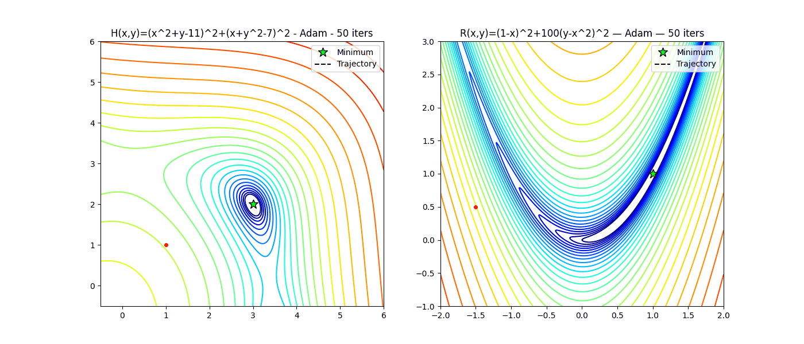

# Структура
0. Абстракт 🚩
1. Мотивация
	1. О римановой оптимизации
	2. О SWATS
2. Многобразие Штифеля
	1. Построение и свойства
	2. Касательно пространство
	3. Проекция
	4. Ретракции
	5. Частные случаи: ортогональная группа и гиперсфера
3. От градиентного спуска к SWATS
4. Общая идея римановой оптимизации 🟩
5. Оптимизация на многообразии Штифеля 🟩
	___
6. CayleySWATS 🚩
	1. Реализация
	2. Критерий
7. Сходимость 🚩
8. Эксперименты 🚩
	1. Возможные модификации
	2. Ортогональное приближение
9. Итоги 🚩
10. Доказательства и вспомогательные факты 🚩
11. Библиография 🟩
# Примечание
🟩 отмечено то, что уже сделано
🚩 отмечено то, что находится в процессе реализации
Как можно видеть, громоздкие теоретическое введение и подводка к самой идее проекта уже сделаны, осталось
- расписать суть преобразования Кэли
- расписать риманов аналог SWATS - CayleySWATS(в чем собственно и состоит задача проекта), попытаться проанализировать сходимость
- реализовать с помощью кода эксперименты с CayleySWATS
- расписать некоторые дополнительные факты в духе того, что устно проговаривалось на НУГ
- сделать больше картинок
Также замечу, что финально вся работа будет выкладываться на notion или github, там отображаются gif, в сыром pdf - нет 

# Реализация
## 0. Абстракт
## 1. Мотивация
1. О римановой оптимизации
	Задачи математического программирования с ограничениями возникают часто, не менее часто хочется искать приближенное решение таких задач, исключая методы безусловной оптимизации(GD, BFGS, Золотое сечение и  др.) и их точное аналитическое решение(ММЛ, ККТ) ввиду сложности вычислений. Более того, не всегда заданные ограничения образуют простые, линейные структуры, что еще больше затрудняет оптимизацию.
	- Например, в Проблеме Прокруста мы рассматриваем 2 облака точек и задаемся вопросом: существует ли такое преобразование поворота и симметрии, что облака совпадут? Если нет, то насколько можно их приблизить этим действием. Формально $$\min_{X \in \mathbb{R}^{n \times n}} \| AX - B \| \quad \text{s.t.} \quad X^TX = E$$
	- Другой важный пример - это метод главных компонент(PCA), в нем мы ищем ортономированный базис меньшей размерности, максимизирующий выборочную дисперсию, то есть мы "сжимаем" данные с минимальной потерей информации об их различимости, а именно$$ \max_{X \in \mathbb{R}^{n \times p}}\operatorname{tr}(X^T C X) \\ \quad \text{s.t.} \quad X^T X = E_p $$
	- Еще одной крайне актуальной сферой, требующей оптимизации на многообразиях, является современное глубинное обучение. Рассмотрим полностью линейную нейронную сеть, то есть набор последовательных входов и выходов, где итоговый выход получается перемножением матриц весов: $y=W_n\cdot W_{n-1} \dots W_1x$. Мы хотим подобрать веса, минимизирующие функционал ошбки $Q$ на имеющихся $train$ данных. Оказывается, что одно из эффективных обновлений весов с помощью оптимизатора Muon считается через взятие ортогональной составляющей сингулярного разложения градиента функционала потерь $Q$, то есть $$W_{k+1} \leftarrow W_{k} - \eta \cdot \gamma \cdot UV^t(\nabla_W \mathcal{Q}),$$$$\text{ где }\eta, \gamma \text{ - параметры, а } UV^t \text{ находится из } \nabla_W \mathcal{Q}=U\Sigma V^t$$
	Конечно, это далеко не все задачи условной оптимизации, ограничения в которых задаются нелинейно, так же можно рассматривать низкоранговую аппроксимацию(LoRA) через SVD и теорему Эккарта-Янга-Минковского, обобщенную проблему Прокруста и другие схожие cюжеты.
	Как можно было заметить, во всех постановках проблем выше участвовали именно ограничения на ортогональность в том или ином виде. Можно рассматривать задачи и с другими нелинейными ограничениями, например, постоянным рангом матрицы, как в LoRA, однако далее будут детализированы римановы методы оптимизации именно для ортогональных(или близких к ним) ограничений, ввиду удобства работы с такими матрицами и уже обоснованной их высокой применимостью в современном глубинном и машинном обучении. 
2. О SWATS
	Выше было сказано об актуальности ортогональных ограничений в ML и DL. Это действительно так, но не каждая задача содержит в себе условия на оптимизацию, что располагает к применению безусловного GD и его модификаций. Многие из этих модификации, отдельные из которых будут рассмотрены ниже, отвечают на конкретную задачу и могут проигрывать другим не в своей специализации(например, малое число итераций, но большая вычислительная сложность каждой итерации в NAG против большего числа итераций с малой сложностью в SGD). 
	Такой частый trade off дает стимул к созданию новых оптимизаторов для агрегирования лучшего в желаемом количеством в частности путем объединения уже имеющих методов. 
	Так, SWATS(SWitching from Adam To Sgd) улучшает обобщающую способность алгоритма, то есть достигает меньшего значения функционала ошибки Q на $test$ данных без чрезмерных дополнительных затрат на вычисления, реализуя сперва быстрый и адаптивный шаг Adam, а после замедления, вызываемого у Adam растущим числом итераций, переключается на Sgdm, причем инерция считается через "проекции" инерций Adam.
	Ввиду того, что подобная идея переключения оказалась применимой для безусловных оптимизаторов, можно считать обоснованным желание обобщить подобный подход с переключением на задачи с условиями, в частности для нелинейных ортогональных ограничений.
	Это и будет сделано ниже в работе.
## 2. Многообразие Штифеля
1. Построение и свойства
	Итак, с целью формализовать упомянутую ортогональность будем называть многообразием Штифеля следующее множеством матриц:
	$$St{(m,n)} = \{ X \in Mat_{m,n}(\mathbb{R}) : X^T X =E_n \}$$
	Его смысл заключается в том, что мы взяли $n$ векторов из векторного пространства размерности $m>n$ и положили их попарно ортогональными, а длину каждого - единичной по выбранной норме(обычно - $||\cdot||_2$).
	Можно проверить, что $St(m,n)$ - действительно многообразие в том смысле, что для каждой точки многообразия существует непрерывное отображение ее окрестности в открытую окрестность $\mathbb{R}^{dimSt(m,n)}$, то есть имеет место гомеоморфизм.
	Причем оказывается, что ${dimSt(m,n)}= mn - \frac{n(n+1)}{2}$.
	Далее установим явные формулы для его основных характеристик, начиная с касательного пространства.
	
2. Касательное пространство
	Мы уже знаем(верим), что для малой окрестности любой матрицы из $St(m,n)$ существует непрерывное отображение, задающее ее локальные координаты в $\mathbb{R}^{dim(St(m,n))}$. 
	Теперь мы хотели бы рассмотреть такой линейный объект из $\mathbb{R}^n$ как касательное пространство к гладкой функции $f$ в точке и применить его к нашей нелинейной структуре.
	Для начала вспомним, что для гладкой(непрерывно-дифференцируемой) функции $f:\mathbb{R}^n \ni x \mapsto y\in\mathbb{R}$  можно рассмотреть неявную функцию $F(x,y)=0,$ задающую поверхность в $\mathbb{R}^{n+1}$.
	Причем касательным пространством (к графику функции $f$) в точке $x_0$ называется $$T_{x_0}\Gamma f = \{ v \in \mathbb{R}^{n} : 0 = DF(x_0)[v] \}$$
	Если вспомнить, что $DF(x_0)[v]=f(x_0+v)-f(x_0)$, а $f(x)\approx f(x_0)+\nabla f(x_0)(x-x_0)$, то в случае $\mathbb{R}^n$ равенство дифференциала нулю означает взятие всех направлений, прямые на которых касаются $\Gamma f$ в $x_0$. 
	Этот подход можно обобщить и для матричных многообразий. Касательным пространства многообразия $\mathcal{M}$ в точке $x_0$ будет называться множество $$T_{x_0} \mathcal{M} = \{v \in Mat_{m,n}{(\mathbb{R})} : DF(x)[v] = 0, \}$$$$ \text{где }F(X)=0 \text{ неявно задает многообразие } \mathcal{M}$$
	Фактически эта запись означает, что мы рассматриваем не все направления в $Mat_{m,n}{\mathbb{(R)}}$, а лишь то поле скоростей, линейное малое движение по направлениям которых из точки $x_0 \in \mathcal{M}$ позволяет оставаться наиболее близко к $\mathcal{M}$.
	Применим это знание для поиска касательного пространства в $X_0$ к $St(m,n)$.
	Мы знаем, что $St(m,n)$ задается как $\{ X \in Mat_{m,n}(\mathbb{R}) : X^t X = E_n \}$.
	Из этого мы можем построить $F(X)=0$ как $X^t X - E_n = 0$.
	Далее применим правила матрично-векторного дифференцирования к этому выражению, чтобы получить условие на все касательные векторы $V$ в точке $X_0$:
	$$D(X^t X - E_n)(X_0)[V]=0$$$$D(X^t X)(X_0)[V]-D(E_n)(X_0)[V]=0$$$$D(X^t X)(X_0)[V]-0=0$$$$D(X^t X)(X_0)[V]=0$$$$D(X^t)(X_0)[V]X_0+X^t_0D(X)(X_0)[V]=0$$$$D(X)^t(X_0)[V]X_0+X^t_0D(X)(X_0)[V]=0$$$$V^tX_0+X_0^tV=0$$
	Таким образом, $$T_{X_0} St(m,n) =  \{V \in Mat_{m,n}{(\mathbb{R})} :V^tX_0+X_0^tV=0\}$$
3. Проекция вектора на касательное пространство
	Теперь мы хотели бы научиться так же явно переводить любой произвольной вектор $Z \in Mat_{m,n}(\mathbb{R})$ в $T_{X_0} St(m,n)$, иными словами - делать проекцию на касательное пространство к $St(m,n)$ в точке $X_0$.
	Для проекции нам необходимо разложить $Mat_{m,n}{(\mathbb{R})}$ в прямую сумму $T_{X_0} St(m,n)$ и $W$, где $W$ - некоторое подпространство, линейно независимое с $T_{X_0} St(m,n)$. Для удобства будем искать $W=T_{X_0} St(m,n)^\perp$, поскольку для любого подпространства $U \subseteq Mat_{m,n}(\mathbb{R})$ верно $Mat_{m,n}(\mathbb{R})=U\oplus U^\perp$, что дает $Z=Z_{proj}+Z_{ort}$, то есть $Z_{tan}:=Z_{proj}=Z-Z_{ort}$.
	Далее будем действовать пошагово:
	- Зафиксируем(поверим), что любое касательное пространство многообразия имеет размерность, совпадающую с размерность многообразия, здесь $$dimT_{X_0} St(m,n)=dimSt(m,n)=mn - \frac{n(n+1)}{2}$$
	- Поскольку мы не получили явной записи подпространства $T_{X_0} St(m,n)$ через линейную оболочку или ядро отображения, будем использовать трюки вместо транспонирования.
	- Рассмотрим $XS$(здесь и далее полагаем $X:=X_0$), где $S=sym(X^tZ)$, то есть $S=\frac{X^tZ+Z^tX}{2}$, причем по построению $S^t=S$.
	- Введем естественное скалярное произведение на матрицах через $<A,B>_E=tr(A^tEB)=tr(A^tB)$.
	- Отсюда $\{XS\} \subseteq T_{X_0}St(m,n)^\perp$. Действительно, для любого $V \in T_{X_0}St(m,n)$ имеет место $tr(V^tXS)=0$, поскольку $V^tX=-X^tV$ из свойств касательного пространства к $St(m,n)$ в точке $X$, а $S^t=S$ по построению. Действительно, пусть $A^t=-A, B^t=B$, тогда $$tr(A^tB)=tr(B^tA)=tr(BA)=tr(AB), \text{ но } tr(A^tB)=-tr(AB)$$$$-tr(AB)=tr(AB)\iff tr(AB)=0$$
	- Теперь покажем, что $dim\{S\}=dim\{sym(X^tZ)\}$ совпадает с размерностью пространства всех симметрических матриц $Sym(n)$. 
		- Во-первых, чтобы задать симметрическую матрицу порядка $m$  достаточно знать лишь ее верхнюю или нижнюю треугольную часть. Суммируя количество таких элементов через арифметическую прогрессию получаем, что $dimSym(n)=\frac{n(n+1)}{2}$. 
		- Во-вторых, если $\overline{S}=sym(A)$, то через эту операцию можно получить любую симметричную матрицу $\underline{S}$, положив $A=\underline{S}$, поскольку тогда $\frac{\underline{S}+\underline{S}^t}{2}=\frac{\underline{S}+\underline{S}}{2}=\underline{S}$.
		- Наконец заметим, что при домножении произвольной матрицы $Z$ на элемент $X^t \in St(m,n)$ мы осуществляем в определенном смысле поворот по построению $St(m,n)$, что никак не влияет на $rkZ$.
		- Итак, получается, что ввиду всех замечаний выше $dim\{S\}=dimSym(n)=\frac{n(n+1)}{2}$ 
	- В заключение удостоверимся, что составляющих дополнительной размерности в $Mat_{m,n}(\mathbb{R})=T_{X} St(m,n)\oplus \{XS\}$ быть не может, то есть что ${T_{X} St(m,n)}^\perp=\{XS\}$. Действительно, при большей размерности ${T_{X} St(m,n)}^\perp$ было бы противоречие с размерностью $Mat_{m,n}(\mathbb{R})$, поскольку $$mn=dimMat_{m,n}(\mathbb{R})=dimT_{X} St(m,n) + dim\{XS\}$$ $$dimT_{X} St(m,n) + dim\{XS\}=mn-\frac{n(n+1)}{2}+\frac{n(n+1)}{2}=mn$$Таким образом, для проекции произвольного вектора $Z$ на ${T_{X_0} St(m,n)}$ следует положить $$Z_{tan}=Z-X_0S$$ $$S=\frac{X^tZ+Z^tX}{2}$$
4. Частные случаи: гиперсфера и ортогональная группа
	Итак, после получения явных формул касательного пространства и проекции вектора на него для $St(m,n)$ мы можем рассмотреть спецальные частные случаи $St(m,n)$ - гиперсферу $S^{n-1}$ и ортогональную группу $O(n)$
	- Поскольку $O(n)$ - это частный случай $St(m,n)$ при $m=n$ все приведенное выше(размерность, формулы касательного пространства и проекции на него) верны и для ортогональный группы. Однако данный объект все еще заслуживает дополнительного внимания, поскольку часто оптимизационные задачи(например, та же классическая проблема Прокруста, имеющая явное, в отличие от обобщенной, аналитическое решение) формулируются именно для квадратных матриц, а также из-за того, что $O(n)$, в отличие от $St(m,n)$, образует некоммутативную группу по умножению.
	- Куда более примечательным частным случаем является гиперсфера $S^{m-1}=St(m,1)$, здесь $dimS^{m-1}=m-1$, поскольку условие ортогональности вырождается, а для единичной нормы последняя координата при выборе всех остальных определяется однозначно.
## 3. От градиентного спуска к SWATS
Рассмотрим следующую задачу:
$$Q(w)\rightarrow \min_{w\in W}, Q:W\rightarrow \mathbb{R}$$
Для удобства положим $W=\mathbb{R}^n$, хотя мы и хотим рассматривать $W=St(m,n)$.

Зачастую аналитическое решение такой задачи является сложным вычислительно, поэтому будем искать его приближенно.

Один из методов поиска такого приближения - __GD__(Gradient Descent), стандартную итерационную формулу которого можно получить или через свойство градиента как направления наискорейшего роста функции в точке, или через непосредственное применение условий первого порядка к локальной аппроксимации целевой функции рядом Тейлора:
$$Q(w)=Q(w_0)+\nabla Q(w_0)(w-w_0)+\frac{1}{2}(w-w_0)^t\nabla^2Q(w_0)(w-w_0)+\overline{o}(||w-w_0||^2)$$
$$\nabla Q(w)=0$$
$$\nabla Q(w)=\nabla Q(w_0)+\nabla^2Q(w_0)(w-w_0)=0$$
Если положить $\nabla^2=E$, то получаем
$$0=\nabla Q(w_0)+w-w_0$$
И преобразуем для искомого вида:
$$w=w_0-\nabla Q(w_0)$$

---
__Когда следует останавливаться?__

Существует множество условий, среди которых:
- $|Q(w_k)-Q(w_{k-1})|<\epsilon, \epsilon=const$
- $|w_k-w_{k-1}|<\epsilon$
- $|\nabla Q(w_k)|<\epsilon$
- $k>N=const$ и т.п.
Если не оговаривается противное, будем считать, что подразумевается второе:
$$|w_k-w_{k-1}|<\epsilon$$
Его легко интерпретировать и оно не требует вычисления значения функции в точке.

В своей стандартной форме __GD__ имеет ряд недостатков, одним из которых является зависимость шага исключительно от градиента в точке, но не от номера итерации.

Решением является введение параметра шага:
$$w_k=w_{k-1}-\eta_k\nabla Q(w_{k-1})$$
---
__Как выбирать параметр?__

Если имеет место липшицевость, что равносильно ограниченному изменению производной, то имеет смысл взять $n_k=\frac{1}{L}=const$, где $L$ находится из $||Q(x)-Q(y)||\leq L||x-y|| \space \forall x,y \in W$.
_Примечательно_, что с выпуклостью функции выполнение липшицевости зачастую может гарантировать сходимость __GD__.

Альтернативный подход к параметру $\eta_k$ применяется в __Momentum__(GD with Momentum):
$$w_{k} = w_{k-1} - \eta_k g_{k}, \space g_{k}=\beta g_{k-1}+(1-\beta)\nabla Q(w_{k-1}), \beta\in(0,1)$$

Интуиция следующая: на каждом шаге мы учитываем не только текущее направление роста, но и инерцию, накопленную шагами до этого, при этом чем больше номер итерации, тем меньше влияют первые шаги. Текущий же градиент берется заниженным для отсутствия скачков в возможно ложных направлениях. Обычно $\beta=0.9$.

Схожая идея реализована в методе __NAG__(Nesterov Accelerated Gradient):
$$w_{k} = w_{k-1} - g_{k}, \space g_{k}=\beta g_{k-1}+\eta_k\nabla f(w_{k-1}-\beta g_{k-1})$$

Здесь мы также накапливаем моменты, но теперь не сглаживаем шум, а наоборот - сразу подставляем будущее значение(look-ahead), не уменьшая градиент. Это значительно увеличивает размер шага, хотя за это приходится расплачиваться возможной неточностью на функциях со множеством локальных минимумов

Еще одним подходом является подбор шага как адаптивной величины, что дает постепенную сходимость без резких скачков, как в GD или NAG.
Такая стабильность необходима ввиду следующего: помимо того, что многие функции имеют локальные минимумы, вычисление градиента даже с помощью трюков типа автоматического дифференцирования является крайне затратным, зачастую берется "шумный" градиент, полученный как среднее меньшей случайной выборки объектов(mini-batch), если взятие такого меньшего множества возможно по построению:
Если $$\nabla Q(w)
= \frac{1}{|N|} \sum_{i \in N} \nabla L_i(w),$$то
$$\nabla Q_B(w)
= \frac{1}{|B|} \sum_{i \in B\subset N} \nabla L_i(w)$$
Именно устойчивость к резким изменениям обеспечивает корректность работы адаптивных оптимизаторов на "шумных" градиентах.

Так, __RMSProp__(Root Mean Square Propagation) накапливает квадраты инерций и нормирует каждый градиент покомпонетно через деление на корень их накопленной суммы, причем в этой сумме инерции затухают экспоненциально для усиления эффекта меньшего вклада первых шагов со временем:

$$\begin{align*}
    &g_{k.j} = \beta g_{k-1,j} + (1-\beta)(\nabla Q(w_{k-1}))_j^2;\\
    &w_{k,j} = w_{k-1},j - \frac{\eta_k}{\sqrt{g_{k,j}} + \epsilon} \nabla Q(w_{k-1})_j.
\end{align*}$$

Если объединить идею адаптивного шага и Momentum, то получится крайне популярный адаптивный оптимизатор __ADAM__(Adaptive Momentum Estimation):
$$
g_{k} = \nabla Q(w_{k-1})
$$

$$
m_k = \beta_1 m_{k-1} + (1 - \beta_1)\, g_k
$$

$$
v_k = \beta_2 v_{k-1} + (1 - \beta_2)\, g_k^2
$$

$$
\hat{m}_k = \frac{m_k}{1 - \beta_1^k}
\qquad
\hat{v}_k = \frac{v_k}{1 - \beta_2^k}
$$

$$
w_{k} = w_{k-1} - \eta_k\, \frac{\hat{m}_k}{\sqrt{\hat{v}_t} + \epsilon}
$$

Как можем видеть, в нем есть и инерция для шага по каждой координате, и адаптивная нормировка градиента за счет накопления инерции квадратов предыдущих шагов.

Упор на взятие градиента на меньшем числе объектов(упомянутый $mini-batch$) делает семейство стохастических оптимизаторов, которые по умолчанию  итерируются, как классический GD, но вместо полного градиента берется как раз $\nabla Q_B$, что ускоряет вычисления, но в то же время значительно увеличивает число итераций.
Так, в __SGD__(Stochastic Gradient Descent):
$$w_{k} = w_{k-1} - \eta_k\, \nabla Q_B(w_{k-1})$$

_Примечательно_, что если опустить параметр $\eta_k$, то SGD (гарантированно!) не сойдется: вблизи минимума каждая новая взятая случайная координата будет перетягивать шаг на себя, ввиду чего получается бесконечное блуждание в окрестности искомого $argmin$.

---

Резюмируя обзор различных модификаций GD, важно отметить, что каждый из методов преследует отдельную цель и может показывать себя лучше альтернативных методов на _своей специально подобранной задаче_, поэтому часто полезен синтез уже существующих методов, решающий _специфицескую задачу_.
Так, может пригодится SGDM=SGD+Momentum, или NADAM=NAG+ADAM, или в целом идейно новый подход(Polyak Heavy Ball и тп.)

---

Как было упомянуто, часто мы берем не весь градиент, а среднее случайной выборки или вообще единственную случайную координату. Ввиду этого особо популярны именно стохастические и адаптивные методы: первые непосредственно решают задачу со случайной координатой на входе, вторые же делают шаг постепенным и стабильным, независимо от входных данных, сохраняя инерцию направления.
На практике упомянутая инерция позволяет достичь больших шагов, чем у SGD, в начале, но в конца она наоборот вредит: при большом количестве шагов аккумулирование информации о предыдущих вызывает преждевременное по сравнению с SGD выполнение условия остановки, что означает худшее приближение решения задачи минимизации.

Эта проблема решается оптимизатором SWATS, который сперва использует ADAM, совершает на каждом шаге проверку на вырождение инерции, а после вырождения переходит на SGDM, делая "проекцию" инерции ADAM на параметр инерции SGDM.

Итак, __SWATS__(Switching from ADAM to SGD):
1. ADAM
	Мы начинаем с описанного выше ADAM
	$$g_{k} = \nabla Q(w_{k-1})$$$$m_k = \beta_1 m_{k-1} + (1 - \beta_1)\, g_k$$$$v_k = \beta_2 v_{k-1} + (1 - \beta_2)\, g_k^2$$$$\hat{m}_k = \frac{m_k}{1 - \beta_1^k}\qquad\hat{v}_k = \frac{v_k}{1 - \beta_2^k}$$$$w_{k} = w_{k-1} - \eta_k\, \frac{\hat{m}_k}{\sqrt{\hat{v}_t} + \epsilon}$$
2. "Проекция" и переключение
	__Когда мы хотим переключиться на SGDM?__
	SGDM имеет вид:
	$$v_k=\beta\,v_{k-1}+\hat{\nabla}f(w_{k-1})$$$$w_k=w_{k-1}-\gamma_{k-1}\,v_k.$$
	То есть шаг SGDM: $p^{SGDM}_k=-\gamma_{k-1}\,v_k$
	Соответственно шаг SGD: $p^{SGD}_k=-\gamma_{k-1}\,g_k$
	Для ответа на вопрос выше попытаемся примерно оценить, какая накопленная инерция была бы у SGDM на данный момент, если бы мы итерировались этим методом, вместо шага ADAM: $p^{ADAM}_k=-\eta_k \,\frac{\sqrt{1-\beta_2^k}}{1-\beta_1^k}\,\frac{\beta_1 m_{k-1}+(1-\beta_1)\nabla Q(w_k)}{\sqrt{\beta_2 v_{k-1}+(1-\beta_2)(\nabla Q(w_k))^2}+\varepsilon}.$
	Иными словами, мы хотим иметь "проекцию" накопленного $p^{ADAM}_k$ на теоретический $p^{SGDM}_k$
	Для этого сперва оценим более простой шага $p^{SGD}_k$, а далее экстраполируем через усреднение, то есть $$p^{ADAM}_k\rightarrow p^{SGD}_k \rightarrow p^{SGDM}_k:$$
	$$p^{SGD}_k\approx p^{ADAM}_k$$$$-\gamma_{k-1}\,g_k\approx p^{ADAM}_k$$
	Из предположения приближенного равенства домножим на $(p^{ADAM}_k)^t$
	$$-\gamma_{k-1}\,(p^{ADAM}_k)^tg_k\approx (p^{ADAM}_k)^tp^{ADAM}_k$$$$\gamma_{k-1}\,\approx -\frac{(p^{ADAM}_k)^tp^{ADAM}_k}{(p^{ADAM}_k)^tg_k}$$
	Так мы получили параметр шага SGD, сделаем экстраполяцию на SGDM.
3. Усреднение
	 Из-за присутствия у ADAM усреднения учтем его и для SGDM:
	$$
	\lambda_k=\beta_2\,\lambda_{k-1}+(1-\beta_2)\,\gamma_k.
	$$
	Сейчас мы получили "проекцию" шага на SGD с инерций.
	Далее нормируем "bias", поскольку и ADAM делает так с инерциями:
	$$\Lambda=\frac{\lambda_k}{1-\beta_2^k}$$
	Все операции выше можно воспринимать как "непрерывное" продолжение инерции ADAM на SGDM.
	В итоге мы получили приближенную проекцию $p^{ADAM}_k$ на $p^{SGDM}_k$.

4. Остановка
	Будем останавливаться, когда "проекция" на SGD будет слабо отличаться на "проекцию" SGDM.
	Как пишут авторы, этот результат скорее эмпирический, но и его можно интерпретировать как некоторую точку "непрерывной склейки" двух оптимизаторов. $$\left|\frac{\lambda_k}{1-\beta_2^k}-\gamma_k\right|<\varepsilon.$$
5. SGDM
	Получив $\Lambda$, используем его как параметр шага в SGDM: $$\Lambda=\frac{\lambda_k}{1-\beta_2^k}$$$$v_k=\beta\,v_{k-1}+\hat{\nabla}f(w_{k-1})$$$$w_k=w_{k-1}-\Lambda\,v_k.$$
## 4. Общая идея римановой оптимизации
На данный момент мы знаем, что у многообразий можно задавать касательные пространства в точке, а также находить проекцию произвольных векторов на эти самые пространства. 
Также нам известно, что градиентный спуск и его модификации позволяют итерационно находить минимум(максимум) функций типа $Q:\mathbb{R}^{m\cdot n}\rightarrow\mathbb{R}$.
Попытаемся объединить эти идеи воедино с целью реализовать итерационную процедуру поиска минимума функции $Q$ на многообразии $\mathcal{M}$:
1. Инициализируем $X_0 \in \mathcal{M}$ 
2. Вычисляем $\nabla Q(X_k)$
3. Вычисляем $${\nabla Q(X_k)}_{tan}=\nabla Q(X_k)-\nabla Q(X_k)_{ort}$$ и определяем риманов градиент как  $$riGrad \space Q(X_k):={\nabla Q(X_k)}_{tan}$$
4. Производим шаг выбранным оптимизатором через применение функции $p_k$ на итерации $k$ к риманову градиенту вместо обычного $$\overline{X_{k+1}}\leftarrow X_k-p_k(riGradQ(X_k))$$ После этого шага нам рано заканчивать итерацию и переходить к следующей: $\mathcal{M}$ как правило нелинейно, точка $\overline{X_{k+1}}$ может не принадлежать $\mathcal{M}$. Поэтому нам необходимо сделать ретракцию - эффективный и экономный по вычислительным затратам способ вернуться на $\mathcal{M}$. В целом ретракции зависят от конкретного выбранного многообразия, однако основная их идея неизменна: вернуться на $\mathcal{M}$ хоть как-то. Конкретные ретракции для  $St(m,n)$ будут рассмотрены ниже. Сейчас же мы завершаем итерацию:
5. $$X_{k+1}=retr(\overline{X_{k+1}})$$
6. Повторяем итерации до того момента, пока не сработает критерий остановки, например,  $$\text{DO }2-5 \text{ WHILE } |X_{k+1}-X_k|\geq\varepsilon$$
## 5. Оптимизация на многообразии Штифеля
Теперь хотелось бы сделать следующее: реализовать общий алгоритм на примере конкретного оптимизатора и ретракции для $St(m,n)$, выявить некоторые имеющиеся проблемы и идентифицировать компоненты, вычисления для которых можно выполнять эффективнее
- Реализация RiADAM на $St(m,n)$:
	1. $$X_0 \in St(m,n)$$ 
	2. $$\nabla Q(X_k)$$
	3. $$riGrad \space Q(X_k)=\nabla Q(X_k)-X_k\frac{{X_k}^t\nabla Q(X_k)+{\nabla Q(X_k)}^tX_k}{2}$$
	4. Перед реализацией шага RiADAM необходимо обговорить первую трудность: адаптивные оптимизаторы, к которым относится ADAM, делают шаги на основе накопленных инерций, однако здесь инерция на шаге $k$ находится на касательном пространстве к точке $k.$ Как перенести инерцию на $k+1$ касательное пространство? Существуют различные способы, один из них - параллельный перенос, то есть каждый раз делать проекцию инерции предыдущего шага на новое касательное пространство. Будем поступать именно так, причем как для инерции, так и для итогового шага $\eta_k$.  $$ \tilde{m}_{k-1}={m}_{k-1}-X_k\frac{{X_k}^t{m}_{k-1}+{m^t_{k-1}}X_k}{2}$$$$ m_k = \beta_1 \tilde{m}_{k-1} + (1 - \beta_1) \operatorname{riGrad} Q(X_k) $$$$ \tilde{v}_{k-1}={v}_{k-1}-X_k\frac{{X_k}^t{v}_{k-1}+{v^t_{k-1}}X_k}{2}$$$$ v_k = \beta_2 \tilde{v}_{k-1} + (1 - \beta_2) (\operatorname{riGrad} Q(X_k) \odot \operatorname{riGrad} Q(X_k)) $$$${\eta}_k = \left( \frac{\frac{m_k}{1 - \beta_1^k}}{\sqrt{\frac{v_k}{1 - \beta_2^k}} + \varepsilon} \right)$$ $$ \tilde{\eta}_{k}={\eta}_{k}-X_k\frac{{X_k}^t{\eta}_{k-1}+{{\eta}^t_{k-1}}X_k}{2}$$$$\overline{X_{k+1}}\leftarrow X_k-\alpha\bar\eta_k$$
	5.  $$\overline{X_{k+1}}=QR$$$$ X_{k+1} = \operatorname{qf}(\overline{X_k})=Q $$
	6.  $$\text{DO }2-5 \text{ WHILE } |Q(X_{k+1})-Q(X_k)|\geq\varepsilon$$
## 6. CayleySWATS
## 7. Сходимость
## 8. Эксперименты
## 9. Итоги
## 10. Доказательства и вспомогательные факты
## 11. Библиография
* **Bécigneul, G., & Ganea, O.-E. (2018).** [*Riemannian Adaptive Optimization Methods*](https://arxiv.org/abs/1810.00760). arXiv:1810.00760.
* **Li, J., Fuxin, L., & Todorovic, S. (2020).** [*Efficient Riemannian Optimization on the Stiefel Manifold via the Cayley Transform*](https://arxiv.org/abs/2002.01113). arXiv:2002.01113.
* **Keskar, N. S., & Socher, R. (2017).** [*Improving Generalization Performance by Switching from Adam to SGD*](https://arxiv.org/abs/1712.07628). arXiv:1712.07628.
* **Li, W., Fiori, S., & Cui, J. (2021).** [*Fast and Accurate Optimization on the Orthogonal Manifold Without Retraction*](https://arxiv.org/abs/2102.07432). arXiv:2102.07432.
* **Bernstein, J. (2025).** [*Modular Manifolds*](https://thinkingmachines.ai/blog/modular-manifolds/). Thinking Machines Lab.
* **Bernstein, J. (2025)** [*Orthogonal Manifold Algorithm Documentation*](https://docs.modula.systems/algorithms/manifold/orthogonal/).
* **Absil, P.-A., Mahony, R., & Sepulchre, R. (2008).** *Optimization Algorithms on Matrix Manifolds*. Princeton University Press.
